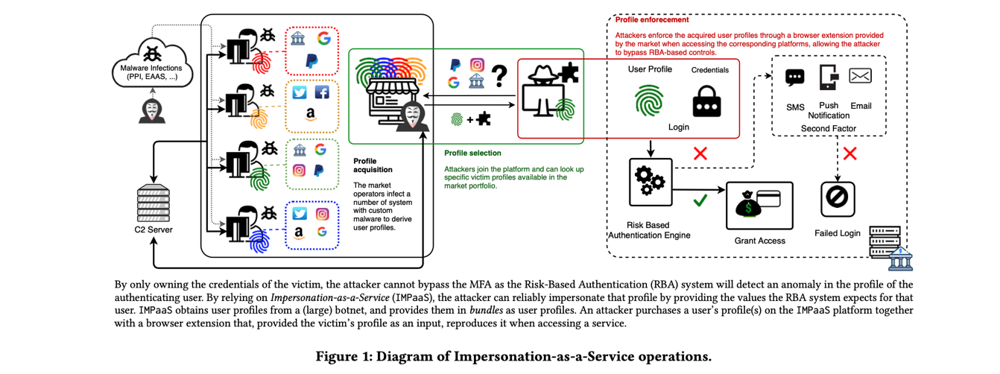
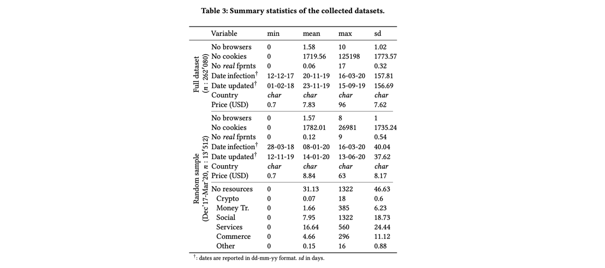

## Impersonation-as-a-Service: Characterizing the Emerging Criminal Infrastructure for User Impersonation at Scale CCS’20

Impersonation 已经开始出现成熟的服务，攻击者可以系统性地获取用户的个人信息（包括身份信息、cookie、设备信息以及行为相关的指纹等等），以绕过某些身份认证机制。本文基于对一个俄罗斯的在线IMPaaS平台（在本文中被匿名化了）行为的分析，首次present了该模型并对其应用进行了evalution。

Risk-based authentication：会根据user登录行为的一些特征（比如设备的指纹等）进行风险评估，如果检测到可疑的登录，就通过类似向可信设备发送验证码的方式来进行multi-factor的验证。于是，一些传统的credential-stolen的方法是绕不过这样的authentication的。但是，IMPaaS提供了一套更加完善的服务，能够对这种authentication也进行绕过。

本文的研究基于对俄罗斯在线平台ImpaaS.ru的分析，对其获取、选择stolen user profile的行为进行了分析，以及对其提供的扩展服务等的效果进行了验证。

### Background

如何绕过RBA：

- 首先，至少要获取password（RBA的第一步）
- User profiling 获取用户的profile或者说finger print
- Multi-platform 验证码可能是通过email等其它渠道发送的，所以攻击者还需要获取user与该服务相关的多个平台的信息
- Profile-update 用户可能更新其登录密码
- Infection infrastructure 需要一个框架（工具）来持续地从用户端获得更新信息（持续地stole）
- Automated profile enforcement 需要一个自动化地利用获取到的用户信息的系统

一些传统的攻击方法在应对RBA方面能力有限？（如上表所述）Leak相当于一次性把用户名和密码拿到，Phishing相比起来能获得一些fingerprint（在钓鱼页面里面通过一些代码就可以实现），Malware具有持续控制用户的可能性。不过ImpaaS相当于不仅cover了所有的环节，还对一些能力做了补充（提供更加便捷的服务）.

### ImpaaS

由如下环节（服务）组成：

- Profile acquisition 由一些botnet以及malware构成，malware的分布渠道可能是多种多样的（钓鱼等），可以盗取客户端的各种信息（用户账户信息、cookie、客户端指纹等等），而且还可以持续更新
- Profile selection 为了提供优质的服务，平台会对收集到的用户信息进行分类（例如基于地理位置、获取到的信息类型等等，方便客户使用）
- Profile enforcement 会提供可定制的软件，里面内嵌了浏览器相关的模拟器，根据采集到的信息尽可能地模仿受害者的环境（例如安装字体类型等都可以定制），从而方便盗取的信息被利用

### 平台/数据爬取

文中分析的平台从2016年开始活跃，到2019年已经拥有了26w的user profile数据量。平台有如下特点：

1. 邀请加入制。只有加入了该平台并且至少消费了20刀的账户可以邀请其它人加入。作者是在地下论坛里面找到的声称可以邀请别人的人并且由此加入的。
2. 平台cover的user profile包括：cookie、resource（用户本地的资源，比如浏览器存储的用户-密码数据等）、fingerprint

数据采集中注意的一些问题：

1. 为了防止泄露身份，作者通过Tor来访问该平台。
2. 限制了用来测量的账号的个数（担心被平台封锁）。

### 数据分析

从2017年12月到2020年3月，共爬取了两年半左右的数据，涉及到26.2w user profile。

主要分析的其实是user profile价格变动和什么因素有关（例如是不是真实的finger print、是否能用来做money transfer等等），通过线性回归进行了分析。

Ethics问题：本文没有花钱购买任何的服务，而且没有爬取任何和用户身份有关的信息，即使是IP地址，看到的也是平台mask之后的。而且本文的数据分析局限在了user profile enforcement之前，也就是只是评估了一下数据集，而并未实际利用数据（这也是本文的一个limitation，分析只能到前半段，并不清楚这些数据究竟可以多么方便地被使用）。

### My comment

本文的优点/值得借鉴的地方：

1. 讨论了一个地下产业中被商业化了的服务ImpaaS，文章前半段对该服务的一些抽象化的特征描述（例如bypass RBA需要哪些ability）、以及整个产业的overview蛮有参考价值的。

To be improved:

1. 其实ImpaaS相较于其他几种已知的攻击来说，最大的好处应该在最后一步，也就是方便利用，但是出于ethics的原因，并不能对这一步进行充分地分析。
2. 本文只是举出了一个例子，但并不清楚in-the-wild，是否还有其它类似的platform、本文分析的platform和前天platform相比规模、覆盖程度、性能（危害）如何。也就是说，我们对该ecosystem仍然缺乏直观认识。