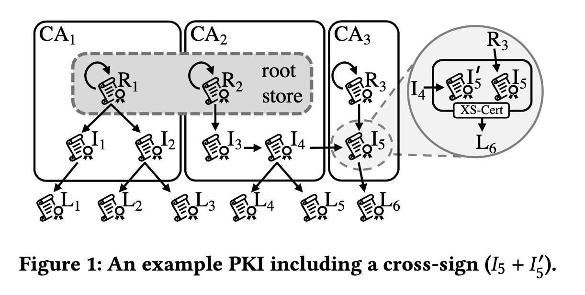
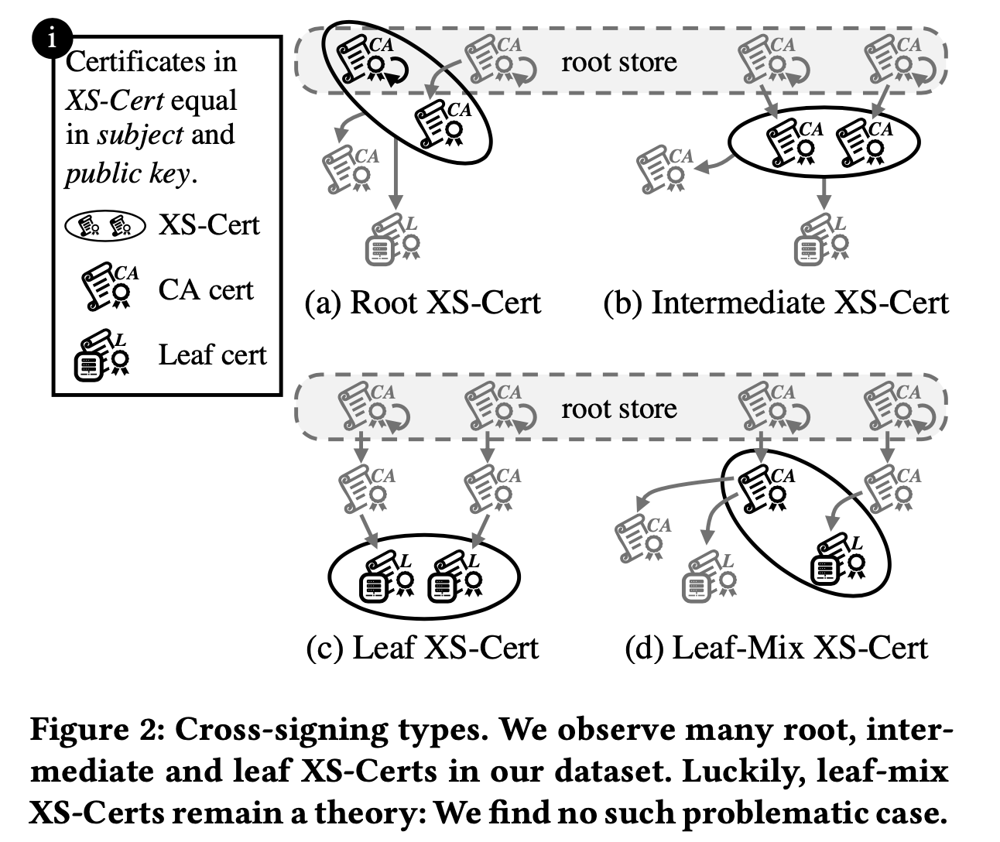

### The Boon and Bane of Cross-Signing: Shedding Light on a Common Practice in Public Key Infrastructures CCS'20

#### 概述

利用了Passive 的 TLS数据以及公开的CT日志，7年时间，225million cert （2亿，原始的TLS链接数为3k亿）以及9.3 billion trust path，对CA cross-signing机制的“福与祸”进行了分析。主要贡献：

- 对不同cross-sign的pattern进行了分类以及分析了其positive以及negative effect
- 分析了cross-sign在web-PKI系统中目前是怎么被使用的，找到了problematic use case 以及legit use case
- 基于分析结果，对cross-sign行为提出了新的rules和guideline，以维持其所带来的收益，而降低相关的使用风险

#### 研究问题

Cross-sign的定义：

RFC-issuer和subject不相同的CA证书（描述地比较模糊，但其实是有歧义的）

本文-两张subject和publickey相同，但是issuer不同（CA证书、中间证书、叶节点证书都在考虑范围之内，而不仅将概念局限于CA证书）的证书

注意：这里要和证书过期重签的行为区分开来。在某个证书过期时，一般的做法是，不变动subject和public key，直接改变证书的valid period，再重新签发一次，（如果这次签发者issuer不同的话），该证书和其原始证书从数据来看和本文定义的cross-sign证书没有区别。由于比如GoDaddy规定了最早提前120天开始为将要过期的证书重新签发新的证书，所以，本文规定了只有在两张证书的overlap超过121天的时候才认为其为cross-sign证书。

四种不同的cross-sign情形：

- Root XS-cert 通常用于当某个新出现的CA还未被trust store收录的时候，为了使其签发的证书可用，就会通过其他位于trust store的CA再签发一张CA证书（subject和public key与原始的CA相同）
- Intermediate XS-cert 与上一种类似的，我有一个证书链是被未受信任的root cert签发的，为了让证书受信任，也可以请其它CA帮忙签发的一个中间CA证书
- Leaf XS-Cert 通常使用的情况是，对于某些特定的客户端来说，其只信任某些特定的root store，为了使证书可用，就需要让那些特定的root store针对特定的web host（domain）签发新的叶节点证书
- Leaf-Mix XS-cert 一种在实际数据中发现了，然而出于安全性考虑并不应该被使用的cross-sign方法

My comment：前三种其实是类似的，就是我有一个证书链，在客户端无法被信任，所以需要另一个受信任的root CA帮忙签发，而至于是为Root CA签发一个Root XS-cert，还是为中间CA签发一个Intermediate XS-cert，还是直接签发一个Leaf XS-cert都可以，只是在成本上/具体的使用场景中可能某种更合适/更方便/符合安全性要求（cross-sign一个CA证书需要的信任等级应该是比cross-sign一个也节点证书要高得多的（因为相当于cross-sign之后该CA签发的其它任何证书都由你背书了））。

共发现了47543 XS-Certs. 本文中主要分析的是Root 和Intermediate XS-Cert （impact比Leaf-Cert更加显著）。

#### 数据分析结果

Cross-sign in the wild

1. Valid Path after revocation. 如果某个证书实效了，那么其cross-sign的证书也应该被撤销（而实际并非如此）。换句话说，cross-sign使得证书的撤销环节变得更加复杂，带来了新的安全问题。
2. PKI Barrier Breaches. CA之间的cross-sign可能导致增加许多并不应该存在的trust-path。
3. The Good: Bootstrapping of new CAs. cross-sign确实在一些CA刚开始启用的阶段起到了很大的帮助（例如Let's encrypt，CNNIC，GoDaddy）
4. Expanding Trust and Alternative Paths. cross-sign的行为可以使某些并不是在所有trust store中都被信任的root CA扩大自己的信任范围；也会被用来给证书提供一条alternative的信任路径（防止原路径上的证书发生unexpected revocation）。
5. Eases the Transition to New cryptographic algorithms. 通常用于维持Intermediate证书算法的向前兼容性（为老旧的客户端保留原始版本的证书）。
6. Effect of ownership-changes on XS-certs. 在CA进行owner-change之前，新的owner就要对目前CA的cross-sign的状况有所了解；同样的，当某个CA的owner change的时候，为其签发cross-sign的CA也应该被notify，并决定如何处理。
7. The ugly：一些实际应用中出现的问题。有些cross-sign的过程中将valid时间段写错了（not before写得比实际地更靠前）。

#### 讨论&Migitation

一些用来改进目前cross-sign机制的建议，例如：

- 通过限制cross-sign证书有效期的长度来控制可能出现的问题的影响范围
- CA需要声明cross-sign的目的
- ownership改变的时候需要良好的notification机制

In short：限制cross-sign的影响范围，并将cross-sign的整个过程变得更加透明。

#### My comments

数据集是valuable的，也确实系统性地分析了cross-sign行为可能存在的问题，但可能因为大部分都是case-study，读起来比较boring...

对其中数据处理的细节有一个疑问，即区分”过期重签证书“和”cross-sign“证书的方法。我觉得：1）并不一定所有的重签证书都会严格遵守120天的规定；2）有些cross-sign行为本身可能两张证书的overlap就不到120天。也就是说，文中区分两种证书的方法虽然在一定程度上make sense，但不知道准确程度如何（可能会影响测量分析的结果、结论）。

