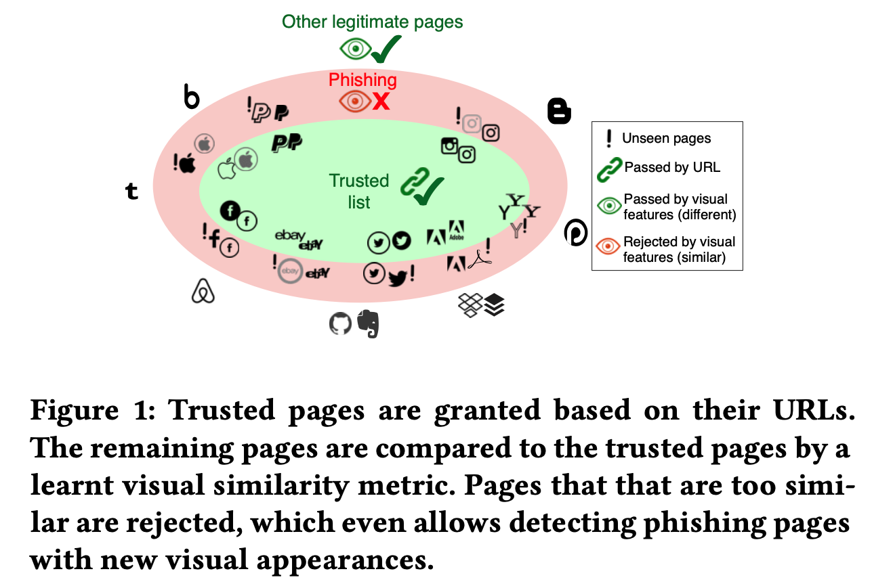
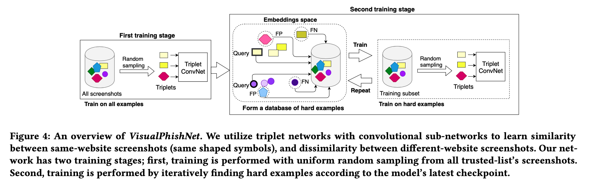

### VisualPhishNet: Zero-Day Phishing Website Detection by Visual Similarity CCS’20

#### 工作概述

构建了一个钓鱼网站检测系统VisualPhishNet，基于CNN，能够学习trusted website的profile，根据视觉上的相似性比对，对钓鱼网站进行检测。（比之前的work效果好，而且鲁棒性高）

事实上，钓鱼检测（即使是基于视觉的也）已经是一个相对成熟的话题。作者claim前人工作的limitation包括：

- 一般选取的trusted-list规模是比较小的（最多的是40几个trust websites），使得构建的检测模型生效范围有限。
- 已有的检测模型对于某个trust website，就只选取了一种trust页面，如果攻击者选择了该trust website的另外一种显示形式（其它子页面，或者更换背景、广告、以及网页的布局），就很容易绕过检测。（之前选取的feature相对简单、固定）

本文的主要贡献：

1. 迄今为止最大的用于钓鱼网站检测的数据集，VisualPhish，包含155个trusted website，9363 pages
2. 提出了VisualPhishNet，一个新的钓鱼网站检测框架，基本的原理如上图所示（其实就是相似度最高的网站会依靠URL作为白名单过滤掉一部分，其余的就是钓鱼网站）

#### The VisualPhish Dataset

- 钓鱼网站，从PhishTank爬取的，人工去掉了不同URL但是视觉上使用了相似的（重复的）页面的网站。过滤之后确定了target到155个trust website的1195个phishing page
- Targeted legitimate website pages，不仅是对155个trust website的home page爬取了截图，而且解析了这些homepage里面所有的internal link，对这些link也进行了爬取（为了cover到钓鱼网站不是简单地copy target网站主页的情况，e.g.，登录页面），而且还cover了不同语言类型的website
- Top-ranked legitimate website’s pages，还爬取了一个legitimate网站数据集，从Alexa top 和 SimilarWeb对不同category的top website进行了爬取（exclude已经在trust list中的155个website）

#### VisualPhishNet

整体的思路其实也很简单，就是比较两个screenshot的相似性。本文选用的网络模型为Triplets，同时输入一个样例，一个负样本，一个正样本，loss function使得样例和正样本之间的距离尽量比样例和负样本之间的举例要小（区别越大越好）。在训练中使用了一些技巧，例如，选取了Global Max Pooling，使得模型对一些local的特征，比如说logo，敏感；另外，整个训练过程分为两个阶段，第一阶段中，triplet network的训练数据组合是随意抽取的；而在第二个阶段，会寻找一些hard example（最边缘的样例）来迭代调整模型（参考了FaceNet类似的加速训练效率的方法，也就是寻找hard example的方法）。

最终，由于模型的输出为两个screeshot的相似度，而只有相似度足够小才会被认为是phishing website，如果相似度不够小会被认为是其它不在trust列表中的legitimate site，所以需要人工设定一个相似度阈值。

#### 实验结果

作者re-implement了一些已有模型，VisualPhishNet的效果要显著地好（从50%+的准确率提升到80%+的准确率）。

#### My comment

其实感觉方法上没有太多创新，文章自己claim的前人工作的缺点其实也没有很好地被解决。本文在模型选择、参数调整、训练过程优化等细节方面可能确实做得不错（结果还挺好的），但整体的new insights不是很多。可以借鉴的可能就是其release出来的VisualPhish数据集。

