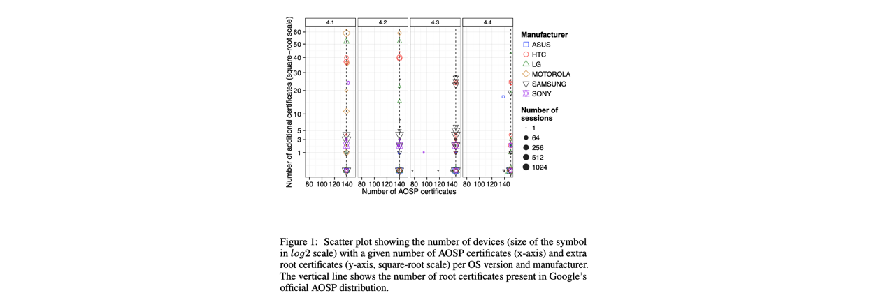
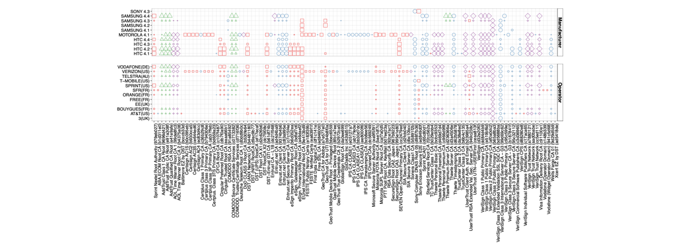

## A Tangled Mass: The Android Root Certificate Stores IMC’16

### 概述

原生安卓系统的根证书来自于Google AOSP （Android Open Source Project）中的root store。但在实际应用中，从设备厂商，到运营商、app或者用户自己，都可能会对该root store进行修改。不同安卓版本的root store也有所区别。

本文研究了安卓用户系统可信根证书列表的实际应用，对比了不同的设备厂商、移动运营商、以及不同安卓系统版本对于root store的影响，发现被root后的设备会被某些app安装额外的根证书，导致系统面临安全风险。数据来自于Netlyzr (Android) 以及 ICSI的Certificate Notary. 主要贡献包括：

- 利用千量级的用户端数据，对比了不同设备和运营商对于AOSP root store的修改，并利用ICSI Notary数据评估了这些证书在互联网中的影响。
- 介绍了第三方app是如何更改root store并破坏信任模型的。

### 数据收集与分析方法

从15790 Netlyzr用户设备上收集到2.3m的根证书数据，去重后数量为314（根据证书signature去重），覆盖到435个不同品牌的设备厂商的3835种设备。下图为在4种安卓版本下，不同的vendor包含的AOSP根证书数量以及额外的根证书的数量的分布情况。

下图对比了某些added证书在不同版本的手机厂商、不同版本的运营商下的分布情况（主要目的是想要找到哪些证书是特定厂商、或者特定运营商安装的）。

此外，还发现了15个在Notary数据中未出现的根证书，大概包括以下几种可能的来源：1）用户为了类似VPN等服务而主动添加的证书 2）运营商的某些特定服务所需要的证书（例如为了地区网络连接的需求）3）政府安装的证书（例如CFCA），可能是通过某些API安装的，也可能是厂商直接安装的。

作者还通过ICSI Notary的TLS session数据评估了根证书的实际影响力（用于签发、验证了多少叶节点证书），发现AOSP4.4中有23%的证书并未用来验证任何的TLS certificates（作者觉得也许可以disable它们）。

### Rooted 安卓设备

24%的Netlyzr数据来自于rooted设备，作者检查了那些更频繁地出现在rooted设备中的证书（5个），全部都未出现在Notary数据中，基本都是一些小的CA签发，可能是在设备本地进行一些安全连接（VPN）等类似的服务所需。

### 其它

- **Case Study of TLS Interception**

作者还对其中一个用于TLS Interception的证书进行了case study（分析了安装该证书的app的行为）。之所以能找到TLS Interception的证书，是因为Netlyzr在记录trust store的同时，还记录了客户端TLS链接的证书链+visited domains。

- **Recommendations**

推荐安卓系统使用强制的、严格的root store管理方式（而不是由manufacture或者mobile operator随意添加）。【从安卓10.0开始，即使升级到root也无法对系统CA目录进行写操作，即，理论上，安卓已执行该保护措施】

### My Comments

- 本文是首次对安卓端root store实际部署情况进行测量分析的工作，并区分了哪些根证书来自于厂商、哪些来自于operator、哪些来自于app（尽管结论并不solid，只是猜测）。作为一篇IMC short paper已经足够。
- 事实上本文cover的数据规模并不大，发现的additional 根证书数量不算太多，对于additional证书（可能是安全风险较高的部分）分析比较少（只是大概推断了来源，以及做了一个case study）。