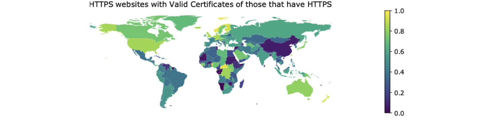
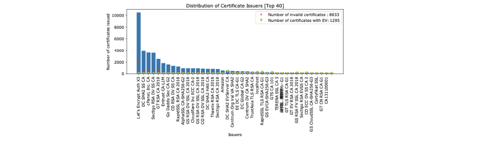
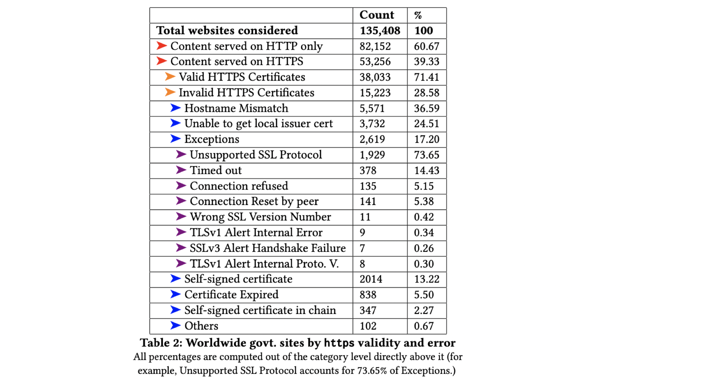

## Accept the Risk and Continue: Measuring the Long Tail of Government https Adoption IMC’ 20

### 文章概述

本文对word-wide范围内政府部门网站对于HTTPS的部署进行了测量。与以往研究的主要区别是：以往研究通常关注于“popular”的网站，例如出现在Alexa Top 1M中的网站。然而政府网站往往是“long tail”的，也就是，其可能总体访问量不大，无法出现在Alexa Top的List中。但实际上，政府网站的利用率还是很高的（有很多市民遇到需求是都一定会访问政府网站），所以关注“long tail”的政府网站的HTTPS安全性还是有必要的。

主要贡献：

- 对global的政府网站（包括未出现在Alexa Top中的long-tail网站）进行了HTTPS的部署测量
- 对CA、加密密钥使用以及其它相关的安全配置进行了测量分析
- 对USA以及South Korea做了case study（获取了官方的政府网站列表）
- 讨论了目前部署中的问题并给出了建议

### Method：获取global政府网站的host list

- 采用正则-白名单过滤

绝大部分使用gov.+国家码，但是也在很多母语非英语的国家中有例外，例如法国用.gouv 西班牙用.gob，作者应该是人工构造了所有可以收集到的正则类型进行白名单匹配（保证了收集到的都是政府网站域名，recall低，但是在本文不考虑）。

- Seed Dataset

首先利用正则表达式，在一些available的top-million dataset里面过滤，包括：Majestic Million、Cisco Top 1 Million、Alexa Top 1 Million、Censys research dataset(from Google Bigquery)

- 对种子集合进行扩展

1. 利用Amazon Mechanical Turk 众包平台做用户调查，收集本地的政府域名。在已有列表cover不到的（或者cover的域名个数有限的）地区发布了任务，要求worker提供6个“尽量不同”的URL，这一步骤共得到138个new hostname，补充到了list中。
2. 对已有list中的hostname进行爬取。首先query已有的域名，再从网页中解析新的url，迭代7个Level。
3. 再通过手工增加一些不符合标准规范的政府域名。人工进行，结合搜索引擎结果等。

此步骤获取的domain list只有10%出现在了原本的top list中。获取后扫描80和443端口，利用openssl验证证书链。

### 测量结果

1. 只有39.33%部署了HTTPS，其中28.08%部署正确。

2. 大多由Let’s Encrypt签发，不同国家的top CA分布差异较大。

3. 最严重的证书错误是 hostname mismatch。其它各种类型错误比例见上表。值得注意的是“host public key pari reuse”的问题，也就是，发现了不同的政府部门网站共用证书（通过wildcard形式）然而出现错误（hostname mismatch等）的现象，除了证书共用，公钥共用的问题也存在。此外，作者还测量了CAA记录的部署，部署率只有1.36%。

4. 根据知名CDN公开的IP地址范围以及测量的hostlist 相应DNS中的A记录地址，将使用CDN服务的政府网站找到，发现CDN的使用可以极大的提高HTTPS正确部署的比例。

### Case Study: 美国和韩国

美国和韩国都提供了官方的政府部门网站列表（ground-truth），而且人口都够多、互联网普及率够高。分析了其证书（CA分布）以及hosting（CDN使用）。

韩国曾经推行过政府自建的CA，但现在已经开始逐步清除、采取标准的CA签发政府网站。不过，从测量结果来看，in the wild，自建CA仍在被使用，只是由于其不断违反证书签发行为标准而被主流的浏览器、工具移除出了信任列表。

### 讨论

- Limitation.
- - Biases. 研究cover到的gov domain list是不全的（recall低），而且相当于只是对https的部署做了一个简单的snapshot，不是longitudinal的测量。
  - Location. 只从华盛顿大学一个点开始测量，一些国家的country firewall，例如GFW，会较强地影响测量结果（例如只有50%的中国政府网站是能够被访问到的）。
- Notification. 向182个国家的gov domain域名注册商发送了邮件（whois tech email），其中39个给了positive的回复。
- Effectiveness. 在发出notification的两个月后重新又做了测量，整体的improvement大概在8.3%（有7个国家能达到40%）。
- Why should Government Care？为什么政府应该重视该问题：1) Censorship. 如果自己没做好https，容易被别人篡改内容；2）Attacks with Valid Certificates. 政府可能会强迫CA签发有问题的证书，用来做中间人，是一种值得警惕的攻击；3）政府网站之间的关联其实还挺多的，例如，澳大利亚的政府官网包含了其它70个政府官网的网站链接，这样如果其中某个出现安全问题，其实澳大利亚政府官网也会受到威胁（一定程度上促成了information mistake）

### My Comment

- 文章的测量、分析工作做得还是挺扎实的，图表的信息呈现也内容比较丰富，但有一些推测结论过于武断、或者没有什么意义。例如说发现国家的人口数量越高，向其发送notification的response的回复比例越低，就有些莫名其妙，因为诸多因素（人口、经济发展水平、网络普及度、政府域名的多样性（可能影响recall）、是否有censorship）都可能影响测量结果以及notification的有效性，“人口数量”这个finding既不怎么make sense，也不能产生有效的guideline。
- 启示：对HTTPS部署的分析相关的题目还是可以继续做，需要限定更具体的场景，针对某个更小的问题做细致、给出有效信息即可。