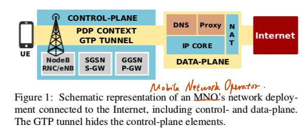
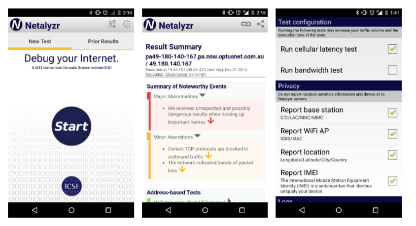

### Beyond the Radio: Illuminating the Higher Layers of Mobile Networks

#### 摘要

ICSI利用Netlayzr工具（运行于安卓平台）采集了大量移动端的网络数据。本文利用该数据分析了移动数据网络的配置、商业模型以及运营商之间的合作关系是如何影响用户的安全和隐私的。文章 的数据cover了6个国家。对middle box包括HTTP和DNS proxy进行了探测，观察他们是如何修改用户数据、影响用户隐私、可能影响安全的。

#### 背景简介

移动的蜂窝数据网络相对于传统互联网来说非常复杂。协议繁多、层间交互复杂、运营商之间也有复杂的配合模式。本文是第一个对移动网络环境中的middel box以及商业合作模式进行测量的。分析了来自70个运营商的、遍布6个国家的数据。

上图展示了移动网络的基本结构。补充两点与本文内容相关的背景知识：

1. Roaming（漫游），具体可以分为：
   1. Home-routed roaming 所有的服务全部接回原网络进行处理
   2. Local-breaking roaming 服务在visited 网络进行处理（需要该网络运营商和原网络运营商存在合作关系）
2. MVNO 移动虚拟运营商，也分成两种：
   1. Light MVNO 有一个parent MNO，基本是买了MNO的服务再作为reseller
   2. Full MVNO 接入网是parent MNO的，拥有属于自己的独立Core IP Network

对于本文来说，roaming两种模式的区别就在于，middle box是属于哪个运营商的。而

#### Dataset and Methodology

数据是Netlayzr收集的，软件截图如上。测量上主要聚焦的两个问题：

1. Network Identification and IP Core characterization 要分开识别三个地址：
   1. 本机的IP地址 - 可以直接拿到
   2. CoreNet的IP地址- 通过echo自己控制的server，可以拿到user的public ip地址 配合一些公开的ip地址分配信息可以识别来自于哪个运营商
   3. SIM属于哪个运营商 - 是通过Netlayzr直接获取权限从本机读取的imsi信息
2. Proxy Detection 
   1. HTTP proxy 检查是否做了tcp代理，检查via头，检查是否强制使用http，检查是否做了host一致性验证
   2. DNS proxy 向自己控制的dns服务器发起dns请求，通过观察响应判断是否存在dns middel box

文中关于数据集的讨论：

1. Ethic问题。文章给出了软件收集的界面截图，并解释说给了用户通过email提问、反馈的渠道（收到700+response）
2. 数据bias问题。用了一个subsection，承认自己的数据有偏差，分别是地理、技术环境（软件需要获取root权限）等方面的偏差。
3. 用了一整个半栏的篇幅解释了是如何清洗数据的，细节补充很到位。包括了移除掉哪些数据、出现问题的现象是什么（为什么移除）、可能的原因是、移除掉的数据量有多少，还给出了一个表格作解释。

#### 实验结果

实验结果显示：

1. Middle box 广泛存在于网络中，其存在、操作均对用户不透明，而且存在修改用户数据流量、泄露隐私等多个安全问题
2. MVNO广泛地存在于文中涉及到的几个国家。Light MVNO会直接继承parent的MNO的安全漏洞。

#### 总结&讨论

Key message：

1. 移动网络环境中middle box普遍存在且具有安全隐患
2. 移动网络operator之间的某些合作模式会使得安全隐患存在传递性

文章优点：

1. **对数据的解释非常到位**，无论是收集过程、bias的讨论还是清洗过程，补充了大量细节。（有抄写背诵的冲动）
2. 测量的角度比较新（在当时看来），对移动环境安全性的**大规模** 测量paper少。
3. 方法make sense，简单有效，解释地也很清楚。

文章不足：

1. 受Netlayzr的限制，能采集到的数据范围其实还是挺有限的，算不上是传统意义上的**大规模**测量，范围上只是cover到了6个国家，数据也只有k的量级。
2. 分析的是几个基础的安全问题，没有对略微复杂一些的安全问题做分析（主要还是聚焦于类似于传统网络的middle box测量，只是在此基础上根据sim、ip等多维度的信息将移动网络的复杂架构拆解成了几种商业模型）。

文章解决的最重要技术难点：

1. 移动测量的观测点，Netlayzr是人家的天然优势orz
2. 移动网络复杂的网络环境，找到了办法识别多层身份，简化模型，而且清洗数据也挺困难的

If I was the author:

1. 可以再多找一些可以测量的移动安全问题
2. 除了Netlayzr以外，还有其它的方式可以进行移动测量研究？（vpn, 寻求企业合作伙伴

