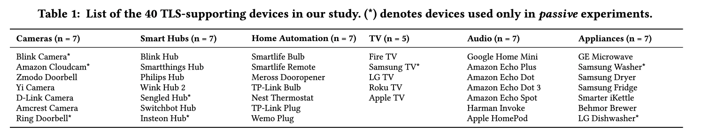
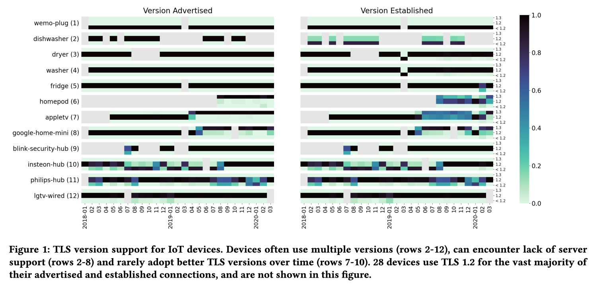
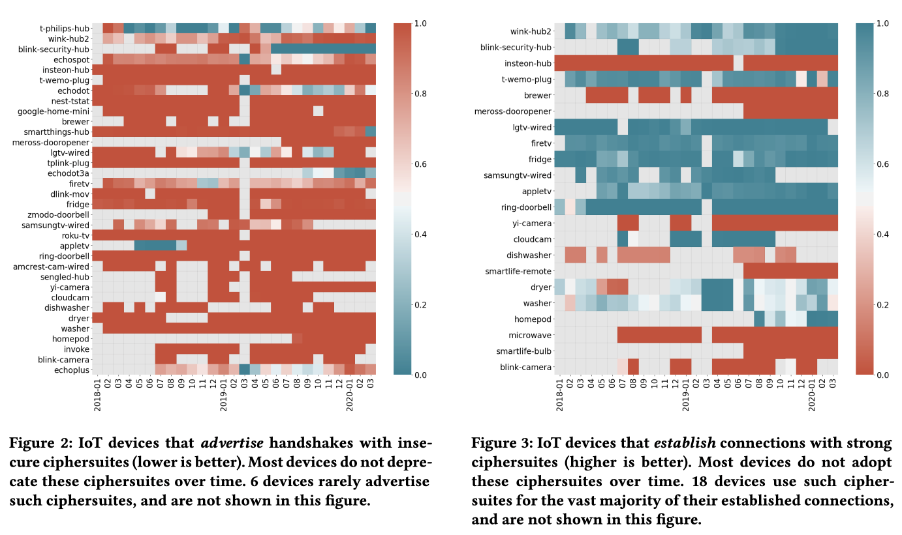
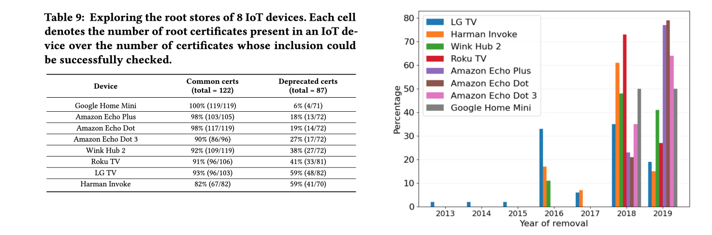

## IoTLS: Understanding TLS Usage in Consumer IoT Devices - IMC’21

### 工作概述

本文研究的是Consumer IoT（零售业物联网，可能是为了和工业物联网相对）在TLS使用中的问题。在2年的时间内采集IoT traffic，通过主动探测的方法发现漏洞，尤其是利用TLS alert message以测信道的方法观察IoT设备的root store，发现了一系列问题。

**Challenges**

1. 大规模地对IoT设备进行源代码或固件分析是相对困难的，可能需要设计黑盒测试的方法；
2. 需要想办法trigger IoT设备的TLS traffic；
3. 如何track the behaviors over time？

**Solutions**

1. 提出了probe IoT设备的新方法；
2. 基于一个观察：IoT设备通常在启动的时候会发起较为频繁的网络连接，本文通过smart plug控制reboot IoT设备，以获取TLS traffic；
3. 在uncontrolled的环境中观察了约2年时间内的TLS traffic usage，并在40台devices上做了passive experiment，在32台devices上做了active experiment；

**Main findings**

1. 协议版本/加密算法版本支持过低/弱；
2. devices证书验证有问题（跳过validation，或者对于hostname检查出错），可能导致流量劫持；
3. root store内含有已被明确建议不信任的CA；
4. 通过检查TLS fingerprint，发现设备在使用TLS library方面也存在风险；

### Methodology

**Testbed**: 40种设备，放置于某个独立空间（模拟studio apartment），有40位志愿者参与使用（uncontrolled的使用方式）。网络流量在房间的gateway上采集，测试分为passive（只记录流量）和active（尝试流量劫持，impersonate the certificates）两种。2年时间内陆续采集到17M TLS connections数据。

**Instrumentation**: 1) 分析handshake消息，观察TLS version、密码套件版本，以及通过clientHello提取TLS library的fingerprint；2）在active实验中检查客户端可能的证书验证问题，包括novalidation，wronghostname，以及invalidbasic constraint；3）分析root store，方法是：对于subect/issuer在root store中根本就不存在的CA，以及subject/issuer存在但是密钥对不上的CA，TLS返回的错误类型可能是不一样的，如果能观察到这种验证结果上的区别，就可以判断某个root是否存在于root store。根据RFC的规定，TLS client may choose TLS Alert Message，来发送unknown_ca 以及decrypt_error两种alert，刚好可以区别某个root是否存在于root store（注意，这里的root store不完全等同于设备的root store or system root store，但确实是某个client端的信任list）。（还顺便通过观察设备和主要负责证书revocation checking的endpoint的Client Hello消息来观察其revocation执行地如何）。

### Results

- TLS connection security

**Takeaways**：一方面其实IoT以及基本支持到了TLS1.2及以上，另外一方面，还有许多设备没有使用最新的协议版本、支持有问题的算法、更新不及时。

- Certificate validation

**Takeaways**：28个设备出现了证书验证问题；通过探测root store发现，有很多理论上应该被撤销/不信任的证书还在设备的root store中，尤其是考虑到IoT 设备实际上只需要和一小部分的destinations进行通信，这样large-range的root store确实没有必要（应该被修改）。

- Diversity of TLS Behavior

**Takeaways**：单个IoT设备可能有多种TLS libraries配置，不同的设备之间也有很多相同的libraries。

### Discussion

- **Recommendations**: IoT设备厂商按照统一的标准来audit，upgrade，以及maintain设备的TLS instances; 用户如果觉得IoT devices在网络连接上存在安全隐患，也可以在其和Internet之间加一个trusted network component来保障安全。
- **Limitations**: 研究的设备种类有限；没能完成一些主动的交互；方法不太能generalize（有些设备不会发送alert消息，TLS1.3改成了optional）。

### My comments

1. Maybe我们也需要（或者找哪位爸爸借）一个这样的IoT（智能家居）仿真环境，并开始收集各种数据。
2. 根据TLS-alert message侧信道探测root store的方法很有意思，虽然并不能对所有的设备都work，而且找到的可能也不是真正意义的“root store”。