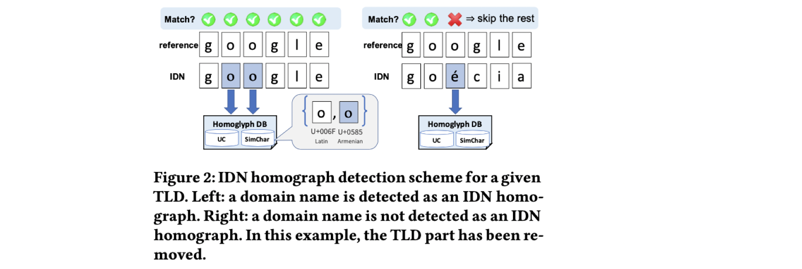

## ShamFinder: An Automated Framework for Detecting IDN Homographs IMC’ 19

### 文章概述

国际化域名（IDN）机制使得可以在域名中使用unicode字符集。而unicode字符集中包含大量视觉效果相近的字符（homoglyph）。IDN homograph attack，就是利用相似的unicode字符串构造钓鱼域名/链接。攻击不是新的，但是随着IDN的普及，影响范围在不断扩大。提出了一种自动检测IDN homograph的系统*ShamFinder*。基于该系统还进行了一个大规模的测量研究，目的是理解真实世界中IDN homograph是如何被使用的。

依据IDNA2008[1]和Unicode 12.0.0[2]，截止到2019年5月，共有137,928个字符可以在IDN中使用。而IDN域名的注册数量也从2009年的2m涨到了2017年的7.5m。*ShamFinder*最重要的特点在于可以不需要大量人工精力的介入就得到homoglyph database，而且可以精确地指出变化了的字符，对防御来说比较重要。作者还利用该系统在.com TLD的域名进行了检测和分析。最后，提出了一种（proof-of-concept的）防御IDN homograph attack的方式。

主要贡献：

1. 提出了一套自动化的IDN homographs检测框架
2. built了一个homoglyph database，可以自动更新，security application可以直接使用
3. 基于该工具，完成了一个in the wild的IDN homograph测量，效果不错
4. 基于该工具提出了一套防御方案

### 背景介绍

IDN近年来越来越多地被注册、使用，使得非拉丁字符越来越多地出现在域名中。一般来说，在使用时，会对其进行punycode转换。（”阿里巴巴“<->"xn—tsta8290bfzd"）

IDN Homograph Attack是指利用视觉相近的字符构造IDN域名（可选字符范围比拉丁字母大得多）。尽管这不是一个新问题，但由于以往IDN的部署和应用的支持还不算特别广泛，所以该威胁的影响范围没有人系统地研究过。

### 构造相似字符集SimChar

文章涉及到的几类字符集合范围之间的关系如上图所示。首先，所有字符都来自于Unicode字符集（137k）。但是，其中可以在域名中使用的（即使在包含IDN的前提下），也只是其中的一大部分（123k）。其次，Unicode Community其实已经提供了一份”confusable list“，里面包含约9.6k（6.2k对homoglyph）可能被混淆的字符。这份清单是手工收集的。作者在域名可以使用的unicode中，利用自动化的方法，寻找相似的char，形成了一个新的相似字符集合SimChar（12.6k字符, 13k对homoglyph），其与UC有部分重合，但又不完全一致。（其实就是完成了一个对该集合的自动化扩充）构造方法为：利用图片相似性。首先使用GNU Unifont Glyphs [3] 得到unicode char对应的图片，其次通过结构相似性算法SSIM计算图片差异性，人工设定阈值，获得相似的pair集合（细节见paper）。

### ShamFinder Framework

检测IDN Homograph的high-level流程很好理解，有一个待检测的域名集合，一个reference list（可能被钓鱼的域名，一般选择hot domain即可），再对它们的相似性进行两两对比。

本文的核心其实就是利用上一步构造出的SimChar集合辅助域名相似性判断过程。如上图所示。首先，tld扔掉不做匹配；其次，长度不一样的扔掉，只对比长度一致的域名；在具体比较的时候，逐个字符进行比较，完全一致或者命中在SimChar或者UC的pair set中则视为一致，继续匹配下一个，否则stop。

### Evaluation&Implementation

- User Study 研究了SimChar图片相似的阈值选择的影响，以及UC和SimChar哪个更具迷惑性
- 计算复杂性评估 寻找pair的时间开销不是特别高（10个小时）

应用：在.com TLD下进行了检测和分析，比较boring，详见paper。

### My Comment

1. 本文是对之前一些IDN检测工作的一个补充。正如作者所说，chrome和firefox对已经IDN做了转punycode的处理（当然，Usenix’ 21 Wang Gang老师的paper说，浏览器做得不够好，是另外一个story），一定程度上能解决IDN Homograph的问题。不过本文各方面讨论地还是挺完整的（包括evalution以及implementation，一些讨论甚至过于细节了）。
2. 事实上，我觉得文章结构可以组织地更好… 总之读起来不是很流畅。文章本身release的工具以及SimChar的结果是valuable的，我喜欢。

### Reference

[1] Patrik Fältström. IDNA2008 and Unicode 12.0.0. Internet-Draft draft- faltstrom-unicode12, Internet Engineering Task Force, March 2019. Work in Progress.

[2] Unicode Inc. Unicode 12.0.0. [http://unicode.org/versions/Unicode12.0.0/](http://unicode.org/versions/Unicode12.0.0)

[3] Unifoundry.com. http://unifoundry.com/unifont/index.html.