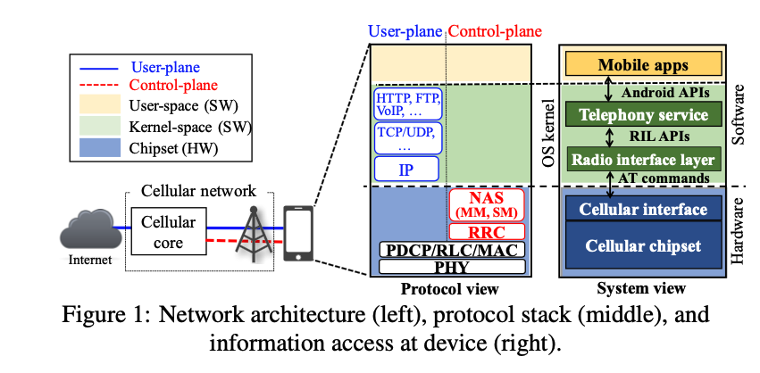
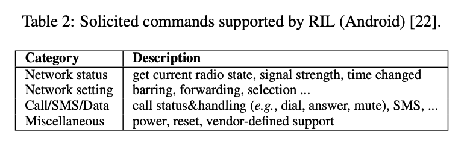
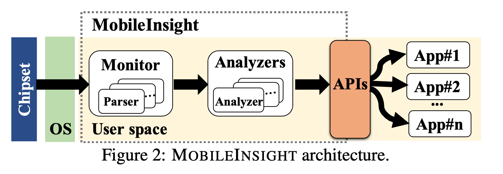
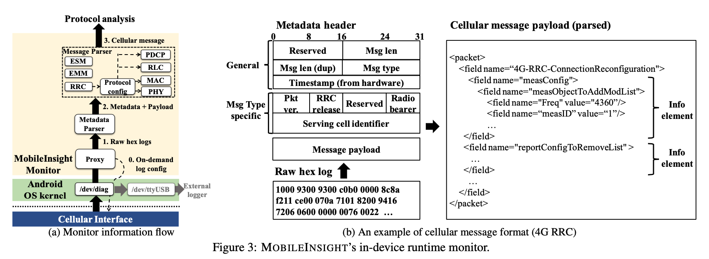
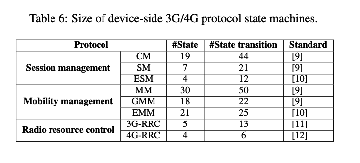
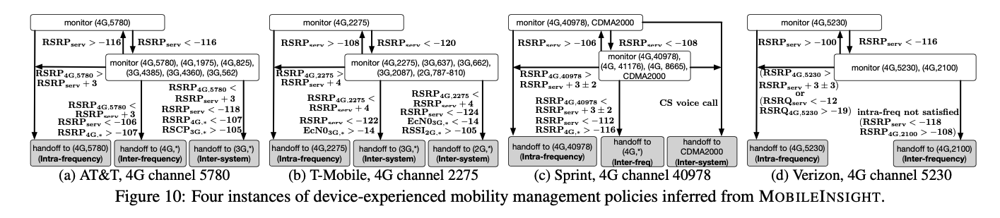

##  MobileInsight: Extracting and Analyzing Cellular Network Information on Smartphones  MobiCom’ 16

### 概述

本工作主要开发了一个移动端的3G/4G蜂窝网络信息分析工具，能够对商用UE的蜂窝网络进行实时检测。不仅完成了对信令的解码，还能够对网络状况、运营商的操作逻辑进行一定分析。其在11个手机厂商的30台设备中完成了测试，能够在0.8ms内处理99%的celluar signaling message。主要贡献包括：

- 开发了MobileInsight，能够对商用UE实时的蜂窝网络协议信息进行解析
- 对于3G/4G协议的状态和运行逻辑进行了分析
- 测试了该工具的效能，并提供了一些使用案例

### 背景介绍

首先介绍了移动通信网络的协议栈。最底层的是物理层，和数据链路层，包括PHY、MAC、RLC、PDCP；再上一层是控制平面协议，分为AS和NAS。AS主要通过RRC对radio access进行控制（资源分配和连接管理）；NAS主要传递非radio信令的数据，包括移动性管理（MM，提供位置更新服务）和会话管理（SM，建立语音会话和数据传输会话）；再上层就是网络层了（IP）。

在UE中，控制平面以及layer1和layer2是写在芯片（基带）中的，无论是内核态还是用户态，能够获取到的移动网络信息都很少。操作系统只能获取一些基本的网络状态信息（通过AT commands），而该信息的部署在不同的设备中差异比较大。一些可以获取到的信息示例如下：

已有的debugging tool，包括QXDM、XCAL等可以解析蜂窝网络，不过其需要和PC配合，而且没有提供协议分析功能。

### MobileInsight的设计与实现

三个目标：

- 实现完全基于移动设备的信令解析
- 对标准的蜂窝网络协议提供分析，包括其状态以及操作逻辑，其中一些是可以实时完成的，也就可以用来做状态提升以及网络错误分析
- 尽可能多、精细地分析移动协议

MobileInsight主要分成两部分：

- Monitor 由多个parser组成，能够对每种协议进行单独的信令解析、分析，从用户态实时地获取蜂窝网络数据；其信息会反馈给analyzer
- Analyzer 分析协议状态以及实现逻辑

1. 获取原始cellular信息：通过安卓的debug接口/dev/diag，连接PC时，该接口可以将cellular信息转向usb接口，本工作直接通过ioctl 命令对该数据进行了抓取。

2. 解析信息。信息包括两部分：metadata（depends on different vendors/devices），这一部分没有标准的实现协议，需要通过不同设备的debug driver的开源代码来手动收集、理解报文格式和数据结构；cellular message payload，也就是移动网络信令，又可以分为两种，像RRC协议已经由3GPP提供了ASN.1规范，可以直接生成message decoder，但还有一些协议没有，需要通过3GPP手动生成decoder。

3. 处理协议之间的依赖关系。一些协议之间即使仅仅是完成解析，也需要另一些协议来完成。例如，PDCP的头部可能由RoHC压缩，压缩的参数是放在RRC Reconfiguration中的。所以，MobileInsight还实现了协议配置的维护，一旦收到了某些依赖参数就完成对依赖该参数的协议的解析。

### Cellular Analysis

1. Protocol State Dynamics.

首先针对每种网络协议，根据其3GPP标准生成了Reference state machine，state的规模如下所示，可以看到其并非特别复杂，也就是mobileinsight是有能力完成实时分析的。

其次，mobileinsight将根据收到的cellular信令类型，参照reference state machine完成对设备当前状态的判断。

1. Protocol Operation Logic的判断。文中主要介绍了（应该也是完成了的部分）是handoff logic的判断。对于网络侧策略的判断有两个挑战：1）策略大部分是运营商自己定制的 2）客户端只能看到网络侧的部分操作/指令来推测 。好在 1）运营商定制策略的空间通常是有限的（会遵循某些recommendation） 2）很多策略的制定需要和UE进行交互的，可以通过观察这类交互来实现推测。本文通过实现QSM，一个状态融合算法，以及结合领域经验完成了推断。以下是四个示例：

### My comment

1. 没有仔细对照过作者在本文之前的工作，但感觉这项工作的信息量/工作量都是相当大的，也需要足够丰富的领域经验才能完成。
2. 对于monitor部分，MobileInsight的信令解析功能可以试用观察学习一下；对于analyzer部分，阅读3GPP协议->构建协议状态机，只是这一项我就已经觉得非常复杂了... 不知是否有前人的工作（或者3GPP提供的资料）可以参考，但是可以找到该项目的源码学习一番。

