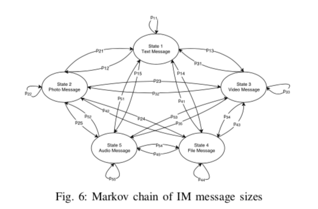

### Practical Traffic Analysis Attacks on Secure Messaging Applications

#### 文章概述

大部分的IM服务都是centralize的，用户通过one-to-one，group，channel communication（有管理员、普通用户等）等多种形式进行会话聊天。由于聊天可能涉及一些政治或者社会敏感话题，所以IM服务也是政府或者军方等机构关注的重点。尽管实现了端到端的内容加密，IM Service的Traffic存在某些feature，可以泄露一些用户相关的信息。本研究分析了IM服务的流量特征，发现大多数IM服务没有做混淆流量特征的措施（成本太高），从而导致特定用户参与特定会话的状态可以被监听。

#### 攻击模型

+ 攻击者第三方，不需要和任何IM取得合作（不能获得任何内部信息）
+ 目的是在某个特定的IM communication中识别participants（IM Users），即某个User是否加入了某个Communication Channel
+ 攻击者本人首先join了该channel，以及在外部监听去往想要观察的target user的流量，将自己在channel中观察到的流量序列与监听target user的序列做traffic correlation，以识别该user是否参与在channel中

#### Step1：对IM Traffic进行静态建模

该步骤的目的是，攻击模型使用了假设检验的方式判断user是否位于channel中，建模可以计算样本偏离的概率，以决定是否拒绝0假设。

利用1000个Telegram channel的流量作为ground-truth，发现IM Service Traffic在以下几个静态特征模型：

* inter-message delay符合某个指数分布

* message-size符合某个马尔科夫转移概率矩阵（观察了不同channel，分布的变化不大）

* communication latency基本符合某个拉普拉斯分布（的正值部分）

#### Step2：设计attack-algorithm

基本思想就是traffic correlation，文中分为event-based和shape-based两种（判断match的方法不一样），随后利用静态模型进行概率计算、判定。细节略。

#### Step3：Evaluation

在Telegram、WhatsAPP以及Signal上对500个channel进行了实验，结果:

Why not Deep Leaning?

* 和deep learning方法DeepCorr做了对比（designed for Tor），效果不如本文的方法好
* 原因可能是IM Flow和Tor Flow存在较多区别，IM Flow更加稀疏、噪声更少

#### Step4：Countermeasure

尝试利用Tor以及VPN进行保护，效果不好，实验证明还是可以被攻击。

采用的防御方法：IMProxy-使用local proxy以及remote proxy增加/去除dummy packets、增加delay（按照uniform distribution）

#### 优点

1. 对流量进行了理论建模，攻击模型形式化地不错，效果也不错
2. 研究问题切入点make sense

#### 缺点

1. 建模部分是根据观察到的流量特征而选定的数学模型，没有从原理上解释，为什么会符合该数学模型。（许多observation直接当做ground-truth使用了，却**没有解释得到该observation的原因**）
2. 攻击模型比较理想化，对现实世界中其它可能扰动（例如target user可能同时在多个channel，是否会有影响，如果target user或者attacker的网络环境不稳定（主要是延时），会有什么影响）

#### If i was the author

1. Deep analytics of the observed static traffic model
2. Add more discussion of the feasibility and applied value of this (kind of) attack