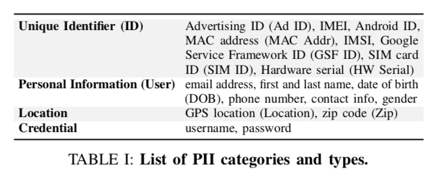
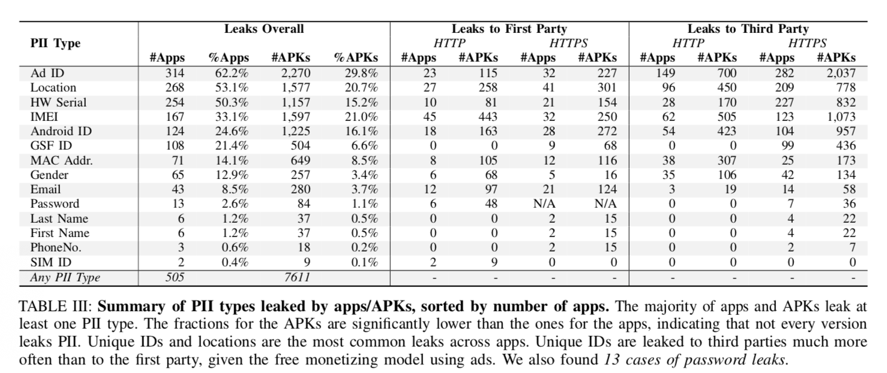
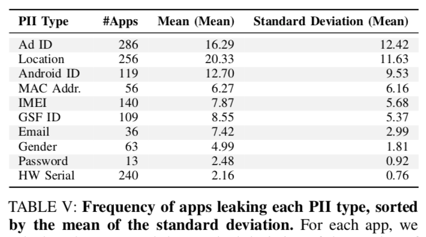
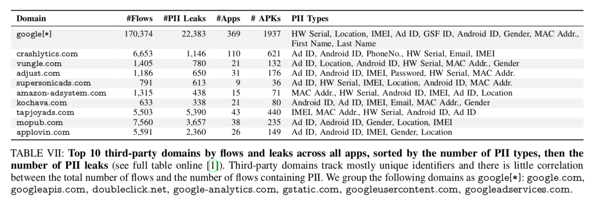
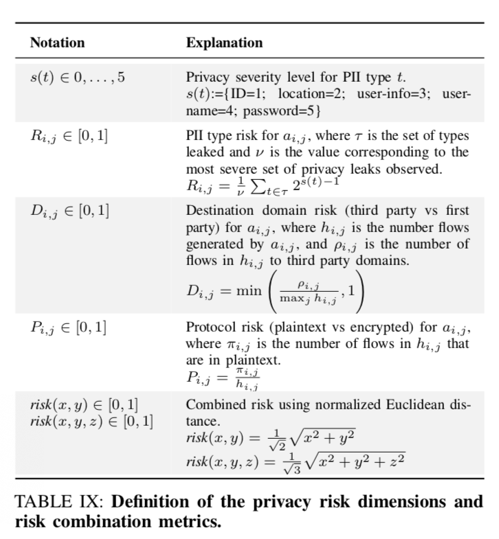
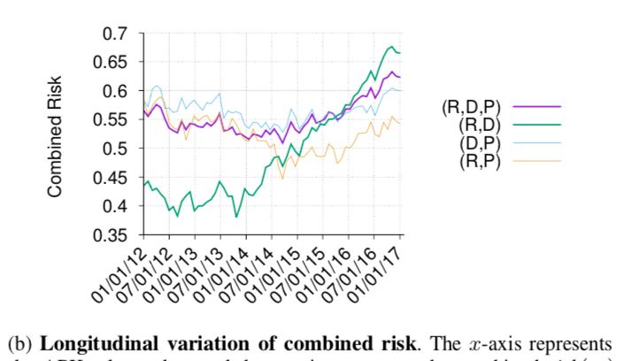

### Bug Fixes, Improvements, ... and Privacy LeaksA Longitudinal Study of PII Leaks Across Android App Versions

#### 摘要

通过自动化的方法，对512个app在8年内的7665个版本的隐私泄露问题进行了分析。发现了诸如，个人信息泄露现象存在上升趋势、HTTPS部署缓慢等诸多安全问题。提出了一套隐私泄露衡量的metrics.

#### Goals and Defination of PII

综合前人工作，总结出如上几类PII（可以识别、追踪个人行为的信息）。

**信息泄露**定义：除非个人信息被已加密的方式发送给App Provider或者第三方，其余情形将被认为是信息泄露。

#### 实验方法

**Key idea**：以自动化的方式运行App并与其交互，通过分析其所生成的网络流量判定是否发生信息泄露。

**Steps**：

1. 选择APP。Most popular，exclude financial apps，require apps have multiple versions。
2. 收集各种版本的APK。参考了前人的工作结果。对于每个app最多保留30个version。通过检查APK中某些文件的修改时间，以及借助一些第三方服务平台，推测该version的update日期。
3. 与APK交互，生成、收集网络流量。为避免app在虚拟环境中的行为与实际环境不同，使用5个真实的安卓手机设备进行试验。使用了可以自动生成随机UI交互时间的安卓工具，**Monkey** https://developer.android.com/studio/test/monkey。 收集流量的方法是搭建了一台服务器作为Proxy，中间劫持设备的流量，其中TLS劫持利用**MITMProxy** https://mitmproxy.org 完成，而若app不支持这种劫持，使用**JustTrustMe** https://github.com/Fuzion24/JustTrustMe 修改安卓系统配置。
4. 隐私信息检查。正则匹配+ReCon（前人工作，Mobisys16）机器学习检查PII泄露。使用WHOIS、Google Play等辅助数据判断PII被传输到什么组织。

**Limitation**：有些被obfuscated的PII泄露是检测不到的。整体是一个underestimated实验。

**Validation**: 对自动交互、可重复性、Domain归类等几个步骤做了validation。

#### 实验结果-从时间维度来看

分析了不同versions的泄露情况，做了随时间变化的分析，统计了信息泄露的频次。

分析了HTTPS传输的部署的趋势，以及在HTTP、HTTPS两种情况下分别讨论PII泄露的程度。

信息泄露至第三方的情况，如上表所示。可见第三方收集PII是非常普遍的状况。

#### 实验结果-多维分析

设计了一些对隐私风险做衡量的量化指标，如下图所示。

依据上述指标privacy risk做了量化测量。结果显示risk是呈现增长趋势的。

#### 总结&讨论

##### Key Message

1. APP PII现象严重，随着时间的变化，风险甚至呈现上升趋势。
2. 对第三方来讲，收集PII是一件非常普遍的事。

##### 文章优点

1. 自动化的产生流量、检测PII泄露，而且APK时间跨度较长，算是比较全面的分析。
2. 提出了Metrics对隐私风险进行衡量。

##### 文章不足

1. Low bound estimate，许多情况没能纳入检测。
2. 或许对于隐私泄露的定义过于敏感了。
   1. 传输到第三方的一定是有问题的吗？Google如此大量的采集第三方app数据，是否有正常用途的可能。
   2. HTTPS部署不佳是一个即使在Internet领域或者说Web领域，也将长期存在的问题，拿来judge PII Leaking的问题不是特别合适。

##### 解决的最重要的技术难点

1. 自动化地运行、交互、获取APP流量，并识别PII信息。

##### If I was the author

1. Deeper Analysis of what is the suitable/appropriate defination of PII Leaking.
2. What real harmness would PII Leaking defined in this paper would be brought to users.

