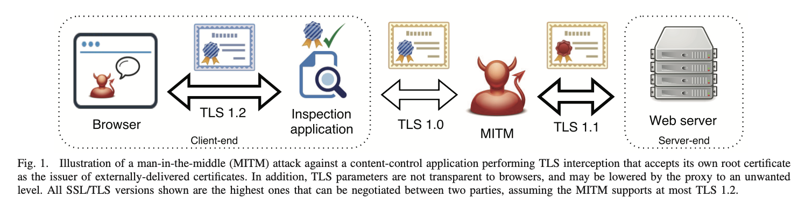
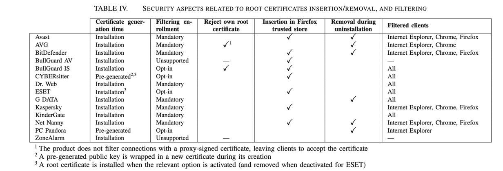
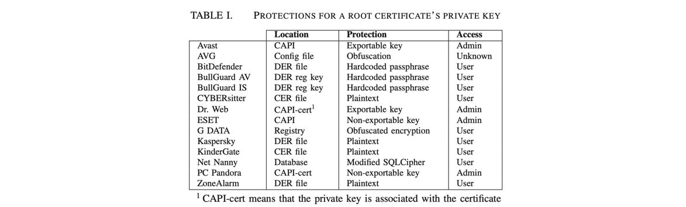
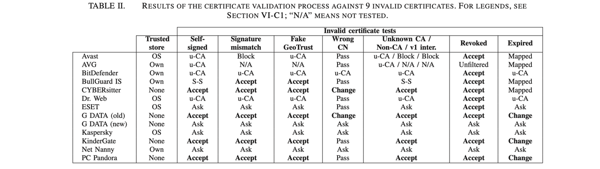
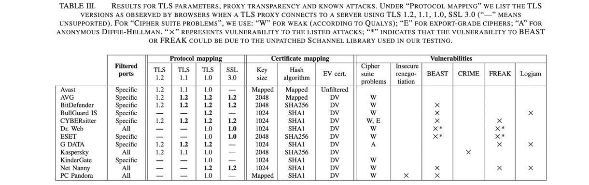

## Killed by Proxy: Analyzing Client-end TLS Interception Software NDSS’ 16

### 文章概述

开发了一个系统性的框架，分析了14个客户端TLS Proxy（杀毒软件+Parent Control应用）的安全性问题。主要关注1）Proxy的根证书、对于密钥的保护 2）证书验证过程（针对与服务端通信的过程）3）server-end TLS参数 4）client-end transparency.

主要贡献：

1. 提出了一套针对TLS Proxy的通用测试框架。
2. 探索了这些proxy生成根证书的方法、保护密钥的措施（使用了各种逆向工程、反混淆的方法试图拿到private key）。
3. 测试了proxy对于后端证书链验证存在的问题（构造了一系列有问题的证书，控制服务端）。
4. 一些已知的TLS攻击对于测试的product来说是否可行（有没有即使更新安全措施）。
5. 给出了一些更安全的TLS Proxy部署建议。

### 背景

Client-side Proxy可能的安全问题：

1. 如果都使用pre-generated 证书（key相同），如果在攻击者获取到了key，那么所有的产品都会受到劫持威胁。
2. TLS proxy还承担了一定的client验证作用（在于后端服务器通信的过程中），验证本身可能存在问题。
3. TLS-proxy理论上要和浏览器一样，对TLS的一些最新的漏洞及时作出修补。（但实际上应该很难做到）

选择测试对象：参考了一些榜单，Popular的content-control application（杀软、parent-control）

植入根证书的行为会导致impersonation attack风险：

1. Key reuse
2. application实效后，根证书可能并没有被移除
3. 安装该根证书的过程用户可能没有得到足够充足的安全提示（甚至是blind的）

### Private Key Extraction

观察安装application前后系统可信证书库的变化，以及安装产生的各种可能相关的文件（.crt, .cert），最后选择了了14种植入了根证书的应用作为研究对象。随后：

1. 找到程序负责TLS filtering的process.
2. Dump这些程序的内存，在里面搜索private key （利用了一个heartleech tool）
3. 恢复passphrase：1）在上述找到的负责处理TLS filtering的process相关的printable characters里面进行尝试，参考了SuperFish的攻击[1] 2) 利用IDA Pro进行反编译，通过openssl负责key生成的函数找到application调用key生成的资源，从而寻找到key phrase 3）Execution tracing 有些CCA对hardcoded的key增加了混淆，需要在执行过程中下断点查看key的值（如果是根据runtime动态随机生成key则此办法无法找到key，本研究中只cover了静态的key）4）如果key用了一些加密数据存储，例如SQL-Cipher的话，则通过在SQL database刚启动时，将query更改为rekey=‘’，即空字符串，以在数据库中获得原始的key

在获取了private key之后，考虑如下安全问题：

1. 生成时间。观察证书是提前预置的还是在安装时生成的。
2. Entropy。生成certificate的entropy是否足够。
3. Self-acceptance。TLS proxy是不需要接收自己签发的证书的（自己签发的证书只用在locally validation的那段通信，而TLS Proxy负责的是与后端server通信的验证）（这个条件好奇怪）。
4. Filter-condition。
5. Expired product licenses。如果CCA过期了，理论上其根证书就不应该再被信任了。
6. Uninstallation。同理，如果CCA被卸载了，它的根证书也应该被卸载。

### 测试框架

挑战：

1. 某些Proxy并没有使用SNI（直接请求获得默认的certificate），导致难以在一个ip上配置多个domain相关的实验。
2. 缓存。Proxy可能会选择缓存证书。
3. Passthrough。Proxy可能有选择性地进行劫持，要判断到底哪些流量被Proxy劫持了。
4. TLS Security Parameter。Proxy有时只对某些特定端口、协议做劫持。

框架：

1. 测试环境。在win7上安装proxy，利用对网关配置不同的IP地址与域名之间的映射关系解决SNI的问题。
2. 证书验证测试。用各种有问题的证书对proxy进行测试，看其是否会接收。
3. 解决根证书信任的问题。我们需要让proxy信任测试使用的证书的根证书（进而测试除了authority之外的其它证书问题），但是，一些proxy是有自己的信任证书库的（而不是使用系统的库，所以直接在系统里进行安装根证书是不够的），如果实在没有办法把根证书植入到proxy的trust list，一个代替方案是使用proxy自己的root key进行签发（利用之前步骤逆向得到的私钥），如果这一步依然不奏效（不是所有的proxy都信任自己的根证书），就只能在网络上寻找和想要构造出错误的证书具备同样错误的证书。
4. 测试支持的TLS版本及已知的各类攻击是否可能实现。

### 测试结果

- 根证书。分析了证书的生成时间、是否支持TLS filtering、是否接受自己签发的证书、是否向xx store注入证书、卸载时是否能卸载证书。详见下表。

- 私钥的保护。分析了私钥存放的地点、保护措施、何种权限可以接触到私钥。详见下表。

- 证书验证（如何处理服务端各种可能的证书错误）。详见下表。

- TLS 版本支持以及是否面临各类攻击的风险，详见下表。（文中给出了关于各类攻击实施条件的更为详细的讨论）

### Recommendation

- 使用TLS key-logging机制（使杀软仍能检查流量），代替traffic interception.
- 直接调用系统的API（CNG)生成、存储密钥（而不是自己实现）
- 需要再openssl验证之外提供更多）例如撤销状态等的检查（但其实很难做好）
- 浏览器可以多做一些事情（在植入root CA时给予警告等）

### My comment

1. 本项工作有很多manually work，包括如何获取私钥等，基本是case by case的分析，虽然工作量大，但能take away的Methodology其实并不多。
2. 针对vulnerability的分析还是挺全的，可以作为测量研究的参考。

### Reference

[1] R. D. Graham, “Extracting the SuperFish certificate,” http://blog.erratasec.com/2015/02/extracting-superfish-certificate.html

[2] ——, “NSS key log format,” [https://developer.mozilla.org/en-US/docs/Mozilla/Projects/NSS/Key_Log_Format.](https://developer.mozilla.org/en-US/docs/Mozilla/Projects/NSS)

