## RFC 4960 Stream Control Transmission Protocol

### Abstract

流控制传输协议：可靠的传输层协议，有如下基本特性：

* 提供无重无错的用户数据传输
* 包分片传输（根据路径MTU Size）
* 多流、有序地分发用户数据，可以根据先来后到的原则分发用户消息
* 可以将多个用户消息打包到同一个SCTP包
* 通过在一个关联的一段或两端支持多宿主，提供网络层的容错能力

### Introduction

#### Motivation

TCP协议尽管已经大规模地投入使用，其自身仍存在某些局限性：

* TCP提供的是严格的按序传输，但某些应用只是需要可靠传输，并不需要、或只是部分需要按序传输，对于这些应用来说，TCP会引入不必要的延迟。
* TCP面向流的特征会引起一些不便，应用程序必须添加自己的记录来对消息流进行划分，以便在合理时间内完成消息传输。
* TCP sockets有限的规模使得在多宿主的主机上进行高度可达的数据传输变得难以实现。
* TCP会受到Dos攻击，例如SYN洪泛攻击。

满足以上所有TCP limitation的一个案例：PSTN（公共电话交换网络）的信令传输（推进了SCTP的部署）。

区别一个概念：**SCTP Association** 是一个比**TCP Connection**更宽泛的概念。每个SCTP Node可以有多个IP地址。

（两个SCTP Node之间的connection都可以看做是一个association？）

#### Key Terms

总结关键概念：

* Active destination transport address | 活跃目的传输地址：一个可以接收用户消息的目的主机的传输地址。
* Bundling | 捆绑？：一个可选项，多条用户消息可以在同一个SCTP包中发送
* Chunk | 消息块：一个SCTP包由多个消息块单元组成，每个单元有自己的头部和具体的内容部分
* Congestion Window：以bytes为单位用来约束数据，sendor发给目的地址
* Cumulative TSN Ack Point：最后一个DATA chunk的TSN值（由SACK的TSN Ack域值决定）
* Idel destination address：在一定的时间长度内没有收到用户消息的目的地址
* Inactive destination transport address：由于错误导致无法传输用户消息的地址
* Message = user message：上层交给SCTP传输的数据
* Message Auhentication Code （MAC）：在SCTP中专指用来验证COOKIE ECHO CHUNK中用来验证State Cookie信息的字段
* Outstanding TSN：已经被某个SCTP节点发出但是还没有收到acknowledgement的TSN
* Path：SCTP包的传输路径
* Primary Path：默认的目的和源地址
* Receiver Window：SCTP Sender维护的一个变量，用来计算其peer最新的接收窗口（了解其peer inbound buffer的接收空间）
* SCTP Association：由两个SCTP终端节点和协议状态信息（验证tages以及当前活跃的TSN集合等）组成，可由endpoints的传输地址唯一标识。两个SCTP终端节点之间不能存在超过一个SCTP assocation
* SCTP endpoint：SCTP包的收发终端，在multi-host的情况下，一个endpoint可由多可用传输地址组成，每个地址=ip + 端口号，注意一个endpoint的sctp 端口号必须是唯一的，但是可以使用多个ip地址
* SCTP packet：SCTP传输的数据单元，由SCTP头部、可能的SCTP control chunks以及SCTP data chunks组成
* Slow-Start Threshold：单位为bytes的一个参变量，SCTP节点由其决定是否开始慢启动或者拥塞控制
* Stream：两个endpoint之间的数据传输通道（无方向），在其中，除了用于无序传输服务的数据之外，其余的数据都是有序传输的

* Stream Sequence Number：流序列号，用在某个stream中，标识消息的序号
* Tie-Tags：两个32-bit随机数，用于State Cookie 和TCB，将一个重建的association链接到已有的association
* Transmission Control Block (TCB)：SCTP终端节点为每个SCTP association建立的一个数据结构，用来存放当前的状态、操作信息，用于管理相关的association
* Transmission Sequence Number（TSN）：序列号，用于标识user data的chunk，防止重传
* Transport address：通常来说，传输地址的定义为：传输层协议类型+网络层地址+传输层端口号；所以对SCTP来说（以IP为上层网络层协议），传输地址的定义为：ip地址+端口号
* Unacknowledged TSN：从接受方来看，是一个已经接收到的TSN（和某个data chunk相关）但是还没有发出acknowledge消息；从发送方来看，是某个已经发出的TSN消息，但是还没有收到acknowledge回复
* Unordered message：对于某些消息来说“无序”的消息
* Verification Tag：32-bit的无符号整数（随机生成），用于检验一个收到的SCTP包确实是对应于当前association（而不是previous association）

#### Functional View of SCTP

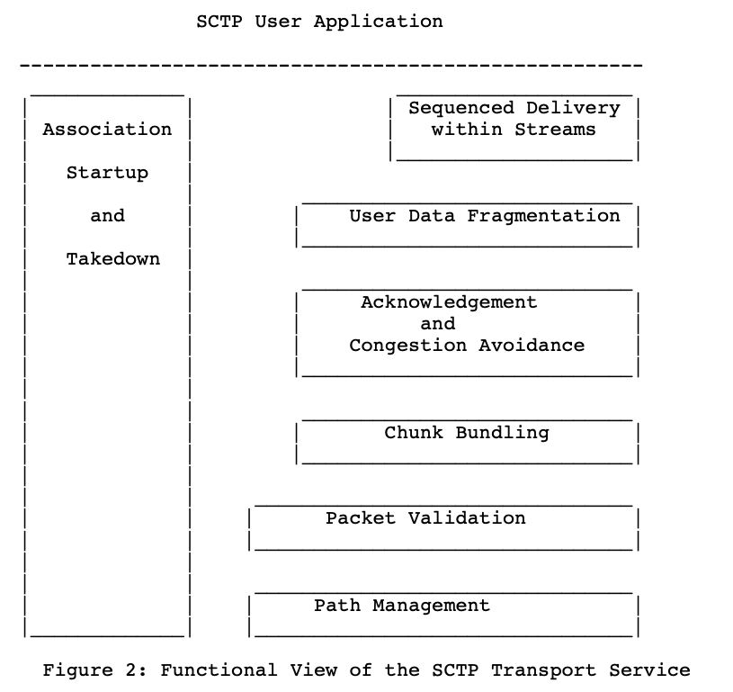

1. Association Startup and Takedown

启动：四次握手、cookie机制。

结束：提供了友好结束（一方提出要求）和非友好结束（可以由SCTP层的错误检测导致结束）。

SCTP不提供向TCP那样的半开放状态（一方close之后另一方还在发送数据）。

2. Sequenced Delivery within Streams

SCTP通信的双方可以在最开始协商该Association支持的stream的数量。单个流阻塞的时候其它流还是可以正常运行。SCTP还提供了绕过有序分发的机制的选项。

3. User Data Fragmentation

SCTP会根据路径最大的MTU对用户数据做分片和重组。

4. Acknowledgement and Congestion Avoidance

每个用户消息（分片）拥有一个TSN号码，和标识流的Stream Sequence Number是独立的。接收方收到任何的TSN都会回复acknowledgement（即使有Sequence上的gap）（保证可靠传输）。packet重传机制和TCP是类似的。

5. Chunk Bundling

SCTP是由common header和一个或者多个chunks组成的，每个chunk要么是user data message，要么是control message。

6. Packet Validation

在common header中有一个Verification Tag field以及32-bit的checksum。Verification Tag是Association双方在连接建立的时候协商的，为了防止伪装攻击和重放攻击；checksum是为了保证数据完整性。Verification Tag不对或者checksum不对时包都会被丢弃。

7. Path Management

路径管理功能是对于end-point可达地址集合的监测和汇报。在startup的时候，会建立一个优先的path。实际上，path management和packet validation是同时发生的。

8. Serial Number Arithmetic

注意在计算的时候需要modulo 2**32.

### SCTP Packet Format

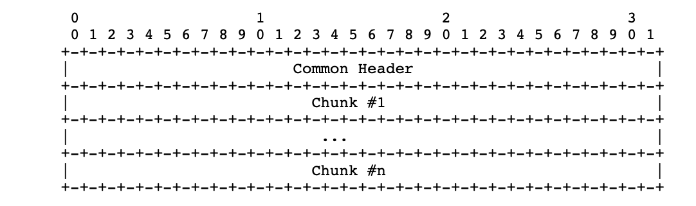

Common Header + 1~n Chunks。注意INIT、INIT ACK 以及SHUTDOWN COMPLETE chunks是不会和其它chunk在同一个SCTP packet中发送的。

#### SCTP Common Header Field Description

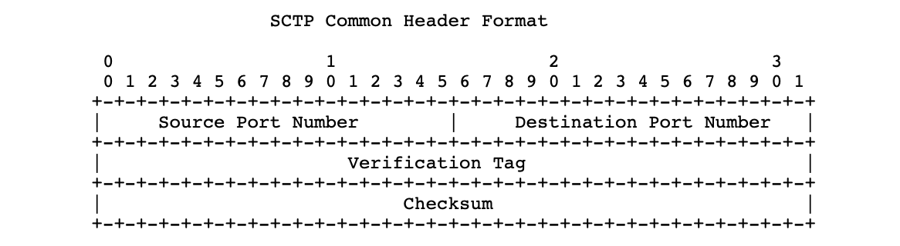

前两个字段：值不能为0。

Verification Tag在INIT时设置为0，其余除了一些特别的控制信令包之外都要和Initiate Tag相等。

#### Chunk Field Description

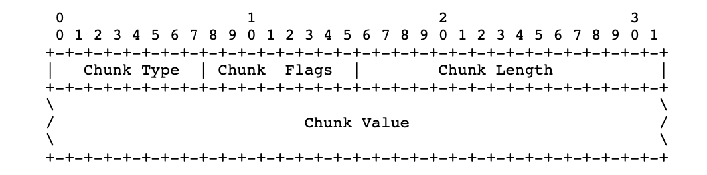

Chunk Type：定义chunk的类型；

Chunk Flag：根据type的值有不同的用法，凡是没有特殊意义的用法，就设置为0或者在receive的时候选择忽略

Chunk Length：整个chunk的长度（不包含chunk padding）

要求chunk必须被padding成4bytes的倍数（用0进行padding）

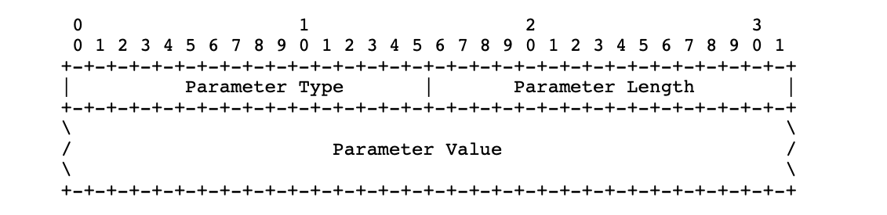

某些类型的chunk可能会带有参数，参数的格式如上图所示。也需要padding成4bytes的倍数（使用0），length字段同样不包括padding长度。注意parameter type是全局uniq的值（对不同typte的chunk也不能重复）

对于INIT chunk中不认识的parameter，有一定的回复机制。

#### SCTP Chunk Definitions

全部的chunk类型如下所示（标注的是本项目可能使用到的chunk）

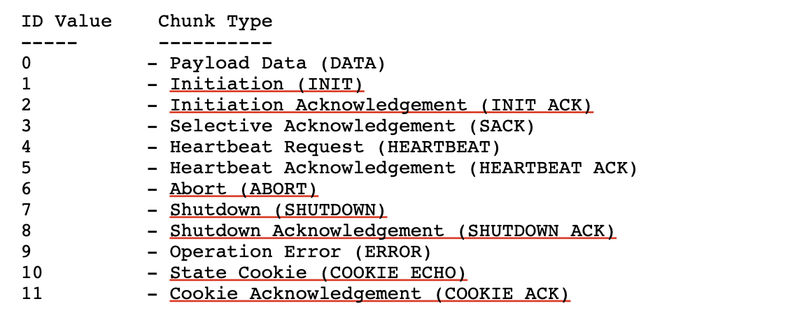

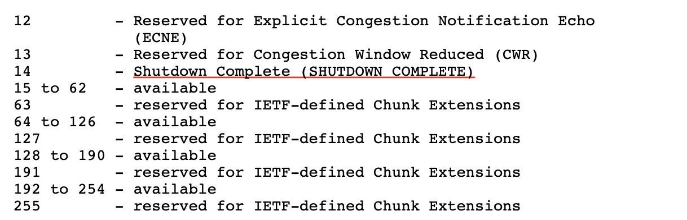

* **INIT chunk**

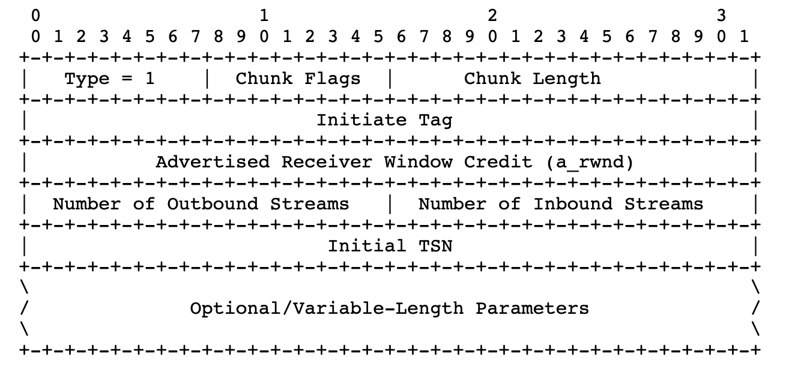

可以包含多个地址（v4、v6各种组合都行）（如果将INIT和INIT ACK的该位都置空的话，更容易穿过一个NAT box）。Host Name Address (用来代替IP address？)，使用该地址也能够增加穿过NAT BOX的概率。意思大概是，**IPv4的地址、IPv6的地址、Host Name都可以用来寻址**。

* **INIT ACK chunk**

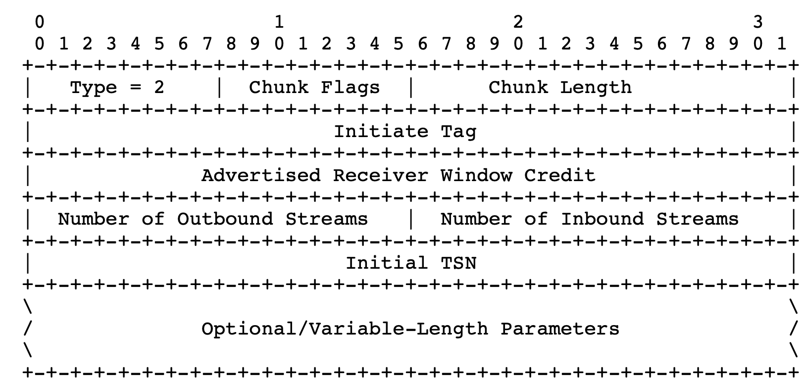

整体参数的格式是和INIT chunk类似的，多了两个参数：State Cookie以及 Unrecognized Parameter。如果收到了不含有未知参数的INIT ACK，按照常规来说，下一个就是要发送COOKIE ECHO了。

* **COOKIE ECHO chunk**

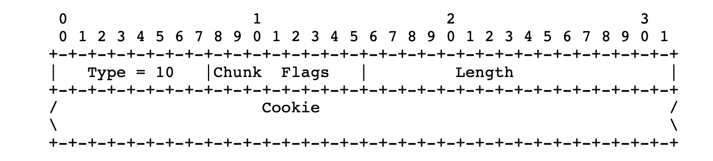

只在association的初始阶段出现，由association的initiator发送给peer（第三步握手）（这时已经可以bundle data chunk，不过data chunk需要放在它后面）。

Cookie字段放的是INIT ACK消息中的State Cookie 字段。（此时cookie不作为一个参数，而直接作为该chunk的data，所以implementation只需要将state cookie parameter的前两个bytes做变动，就可以将其变成一个cookie echo chunk）。

* **COOKIE ACK chunk**

只在association的初始阶段出现，标志着收到了cookie echo chunk。和cookie echo chunk类似，其必须出现在任何的data chunk之前，但可以和data chunk bundle到同一个sctp packet。

* **ABORT chunk**

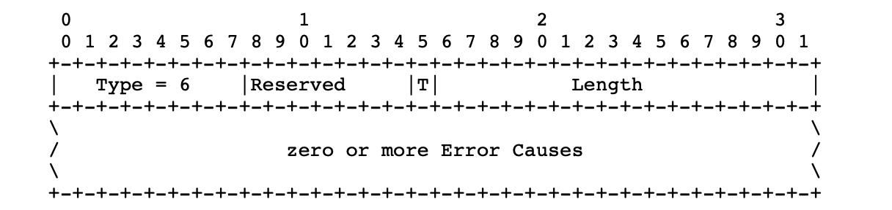

是用来**终止association**的，可能会包含表示cause parameters说明终止的原因。（abort chunk后面的chunk即使是在同一个SCTP packet里面也不会被receiver处理了（会默认丢弃掉））。如果收到了格式错误的abort会默认丢弃。

* **SHUTDOWN chunk**

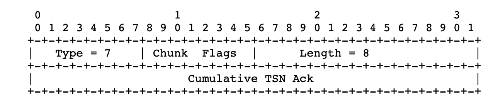

用来graceful close association。

* **SHUTDOWN ACK chunk**

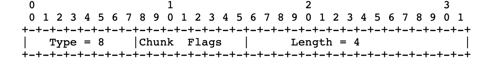

用来响应SHUTDOWN消息（没有其它的parameter）

* **SHUTDOWN COMPLETE chunk**

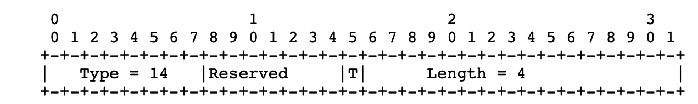

用来表示收到了shutdown ack chunk，完成了shutdown的过程。同样的，该chunk也没有parameter。

* **Error chunk**

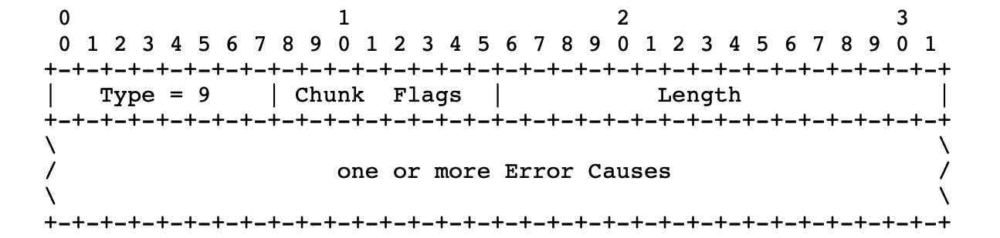

可以包含一个或者多个错误原因（类型代码见RFC）。发送该chunk并不代表出现了特别严重（导致必须终止）的错误，不过该chunk也可以和ABORT一起发送，表示fatal error。

* **HEARTBEAT  & HEARTBEAT ACK**

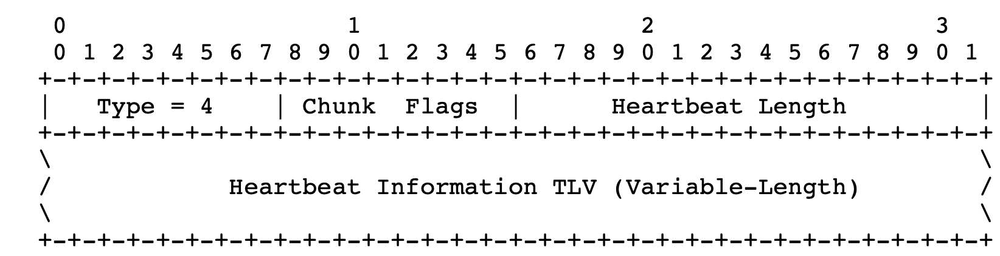

用来确认自己的peer是否reachable。

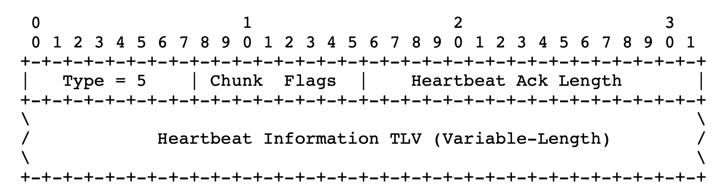

### SCTP Association State Diagram

本节介绍SCTP协议的状态转移图，能够触发状态转移的event包括：

* 来自SCTP user的primitive call：ASSOCIATE、SHUTDOWN、ABORT
* 接收到control chunks：INIT、COOKIE ECHO、ABORT、SHUTDOWN, etc
* 某些timeout events

其实主要就是association的start 和 shutdown，establish好了之后就传data chunk，没有特别复杂的状态。除了发送chunk之外，还涉及到两点：

* 在association建立的时候创建TCB，关闭的时候删除TCB
* 部分控制信息发出后设置timer，防止timeout

### Assocation Initialization

一旦链接建立后，将开启双向的流传输机制。

#### 正常的链接建立流程

1. 一方（A）发送INIT，在其中设置自己的Verification flag（某个随机数），发给对方（Z），自己进入Cookie-wait；
2. Z收到后回复INIT ACK，将A的Verification flag回复，并选择自己的verification flag，同时回复一个state cookie；
3. A收到INIT ACK后，需要将收到的cookie以cookie echo的形式回复给Z，进入cookie-echoed状态；
4. Z收到cookie echo之后，回复cookie-echo ACK，建立TCB，并进入established状态；

注意： INIT和INIT ACK都必须是单独的chunk，而cookie echo 和 cookie echo ack后面都可以加data chunk（在同一个sctp package里面，但是cookie chunk必须在最前面）。

注意：如果收到invalid INIT/INIT ACK，则需要（should）回复ABORT，并提供ABORT的具体原因。

**如何generate state cookie**

1. 根据收到的INIT消息和要发出去的INIT ACK消息建立一个association TCB
2. 将TCB中的creation time设置为当前时间，并配置cookie的life-span
3. 将TCB的identifier（minimal information to recreat the same TCB）集合起来，通过一个secret key生成一个MAC
4. 将MAC 和 identifiers 一起组合生成state cookie

关于state cookie的一些要求

1. 包含MAC（防止Dos）
2. secret key必须是随机的
3. 必须经常更换
4. 为了保证交互性，cookie要尽可能地小

**如何处理cookie相关消息**

对于association的发起方：如果接收到INIT ACK之后，必须马上回复cookie echo（with INIT ACK中接收到的state cookie），然后设置一个时钟，若超时未收到cookie echo ack就再重传，直到收到ack或者到达最大超时次数。

对于association的接收方，需要对收到的cookie echo message 进行authentication，以下几种情况将无法完成验证：

1）state cookie与之前发送给peer的不一致，则静默丢弃；

2）cookie echo chunk中的port number以及verification flag与SCTP common header中的真实的port number 以及verification flag不一致，则静默丢弃；

3）cookie已经超过了其life-span，需要返回给对方一个cookie 超时错误信息；

#### 如何处理链接建立过程中的异常消息

在一些情况下会出现用来建立链接的chunks重复/或者并不在通常建立链接的state收到该chunk的情况（如，双方同时请求建立链接、一方restart重建链接、存在attacker等）。RFC规定了处理这种异常initiation chunks的机制。有些会被直接discard，有些是需要回复的，具体case见RFC原文。

除了重复chunk、异常chunk之外的其它错误还包括：Tag Value选择（范围、随机性）、Path Verification（claim的地址为其真实持有且可达，有heatbeat验证机制）

### User Data Transfer

【先跳过】

### Congestion Control

【先跳过】

### Fault Management

1. **Endpoint failure detection.** 通信的双方都会维护一个retransmission相关的信息记录，当重传超过阈值次数或者heatbeat消息指示该节点不可达时，则自动关闭association。
2. **Path failure detection.** 同时，由于SCTP可能是multi-homed，每条路径（address）也会被维护一个是否可达的信息，当重传到达一定次数则标记为不可达；该状态是动态调整的，即，如果收到新的TSN或者heatbeat ack，则将该address 的error count清零。
3. **Path heatbeat**. 一旦进入established state，heatbeat就可以开始了，直到shutdown结束。
4. **"Out of the blue”packets.** OOTB packet，意思是，该packet的格式是正确的，但是终端无法判断其属于哪个association。几种情况下都是直接忽略该消息，值得注意的是，<u>*如果收到的OOTB packet是shutdown ack，那么receiver是需要回复一个shutdown complete的*</u>（可以用来扫描）；又或者，在排除了x种情况之后，<u>*receiver需要回复abort*</u>（再仔细看看，也可以用来扫描）。
5.  **Verification tag**. 除了收到initiation chunks之外，其它的sctp packet在收到之后首先就需要验证verification tag，如果不match则直接静默丢弃该包。

### Termination of Association

### Interface with Upper Layer

### Security Considerations

