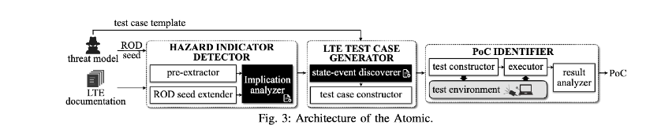

## Bookworm Game: Automatic Discovery of LTE Vulnerabilities Through Documentation Analysis - S&P’ 21

### 概述

以往的LTE相关研究基本通过人工分析的方式寻找漏洞，human effort耗费巨大。本文的思路：提出**Atomic** （automated LTE documentation to vulnerability discovery），基于NLP技术（Textual Entailment 文本蕴含）分析LTE document找到一系列hazard indicators（HI），再根据这些HI生成测试样例验证是否真实存在该攻击。

本文通过对LTE NAS control plane 文档的分析，针对两种攻击模型：通过core network对UE进行DOS攻击，以及通过伪基站对UE进行DOS攻击，对Atomic进行了验证。共发现10个核心网的漏洞和32个UE端的漏洞。（模型发现HI的过程和HI转换到测试样例测试漏洞的过程都几乎无 漏报 和 误报）。

值得一提的是，本文发现HI的位置有不少是直观来看和“security”无关的文档片段（以往研究主要参考的文档内容）。本文的finding报告给了部分设备厂商和相关的机构，得到了一些confirmation。

### Background

- **EPS Mobility Management Protocol （EMM）**是NAS的子协议 （3GPP TS 24.301），主要负责Mobility （attach，detach，tracking area updating 以及 service request）和Security（GUTI reallocation，identification，authentication以及security mode control）。
- **Textual Entailment （TE）**蕴含识别，用来判断某个文本片段（“前提”）是否能推理出另一个文本片段（“假设”）（类似于一阶逻辑中的“蕴含”）。如果找到包含关系，且“前提”成立，则“假设”成立。目前最好的TE model能达到92%的accuracy。
- **Dependency Parsing** 依存句法分析，找到句子内词语之间的依赖关系（grammatical relation）。
- **Threat Model** 攻击模型可以看作是一个四元组 T(threat model) = {A(actor), O(operation), I(information), G(goal)}。本文研究了具体的两个威胁模型（malicious UE and malicious fake base station）

### Atomic的设计与实现

主要流程（如上图所示）：1）人工定义 risk operation （ROD）2）利用NLP方法扩展ROD 3）在LTE文档中找到ROD，以及找到HI，和其相关的state与event，并生成test case（actor，state，event，parameter） 4）将生成的测试样例在LTE模拟环境中测试（执行test case），根据simulator的log file判断攻击目标是否达成。

- **Hazard Indicator Detector**
- - **ROD seed extension** 研究人员针对某个threat，首先提出一个ROD，这部分的目的是，在文档中找到其它类似的相关的ROD。采取的方法是：ROD往往是一个verb phrase，就像abort procedure，想要在文档里找的也是verb phase，所以先找到document中所有的verb phase，再假设前后两句话中出现的verb phases是有关联的，计算verb phase之间的关联度（pointwise mutual information），根据阈值选出相关联的new ROD。（实际应用中，T1找到了5个ROD，T2找到8个）
  - **Implication analysis** 首先找到所有的conditional statements（表示某种条件），能够找到某些message events和这些ROD之间的蕴含关系，这些句子就会被标记为HI。随后就是对这些HI的句子进行蕴含推理分析（TE），利用TE找到If相关的前提包括什么，再判断是否其能推断出一个包含ROD的short sentence。（实际应用中，首先从NAS文档中找到了5652个候选conditional statement，sample了1000个，并标记出了19个hazard indicator as groundtruth。随后在调整TE算法时，本文的原则是：尽可能多地找到LTE的错误，于是希望recall尽可能高，最后选取了100% recall、55.88%precision的阈值，共在13,598 sentence中找到了192个HI）
- **LTE test case generation** 需要完成 “content-to-test-case translation”
  - **LTE procedure modeling**

要完成测试样例的生成（了解触发安全隐患的state和event），首先要对LTE网络的stateful information了解够深入。本文为每个LTE procedure 生成了high-level的状态机模型。注意本文的状态机不是完整的状态机，而是相对简单的（roughly describes）描述某个过程是如何工作的（只关注“key messages”）。3GPP的文档中有为每个procedure提供一个简单的状态转移图，本文的状态机就是根据这个状态转移图生成的（过程比较简单，没有考虑多个procedure交互的信息，但作者claim它们找问题的时候也没有考虑多个procedure交互才出现的问题，所以这种状态机的构建还是work的）。（实际应用中，作者共共建了9个状态机，涉及到76个状态，和26种消息模版，作为Atomic的Knowledge Base，该数据开源在[1]）

* **State-event discovery.** 利用HI的conditional clauses恢复message information（其实是用了一些adhoc的方法，比如遇到verb （send、receive）就去找它的obj relation。除了消息Name本身以外，有的消息还会携带参数（例如#后面跟参数），作者其实也是通过经验总结的方法找到了如何寻找此类参数。此外还有一些细节的处理方法，详见paper。

- **Test case generation**

测试样例包括：vulnerable states，message（event），上图是一个case （还参考了3GPP提供的消息格式样例）

- **Testing and PoC Identification**
- - **Test environment building** 利用SDR和开源的协议栈软件实现了测试环境。注意，为了能够了解PoC的信息（attack是否成功），作者对软件进行了“Hook”，不过这个hook非常简单，就是在处理接收消息和发送消息的code之前，每个hook包含两个功能，一个是notify，能够操控具体的消息发送行为；一个是sleep，为攻击留出一个window（for communicating delay）（但注意作者claim 实现end-to-end real-world attack的时候没有开启hook功能了就）。
  - **Dynamic test construction** 通过调用Hook对测试样例模版进行测试。此处一个难点是，如何使得system走到target state。其中最简单的情况是，所需要的测试样例在所有正常的procedure中都会被自然出发，这样的case有几个；针对另外几个需要额外附加条件才能出发的测试样例，作者增加了几个额外的hook，专门出发所需的state。
  - **Test execution and result analysis** 实验中，PI通过读取config文件以及reboots系统重复进行测试，记录了所有eNB和EPC之间的消息，并且在network log file中寻找UE被Dos的event（有的消息类型出现就表明UE被dos了）。

### Evaluation and Discovery

时间开销+检测的各个步骤准确率衡量 不详细介绍。主要利用Open5GS，OAI、srsLTE进行测试，共42个漏洞（无法在commercial网络中进行测试）（10个是simulator的问题，32个是UE的问题）。但注意，这些漏洞并不都能够直接构成某个攻击（属于某个攻击的一环），但作者也claim，这些漏洞在一定条件的真实环境中都可以被利用。其针对真实环境还做了一个测试（downlink sniffer），证明自己的某些攻击procedure是可行的。

### Reference

[1] https://sites.google.com/view/atomic-bookworm

### My Comments

1. 对3GPP文档用NLP tools进行处理并用来解决安全问题，是很困难的一个task，本文通过各种方法克服了诸多困难，最终做出了一个work的系统，是非常值得敬佩和学习的。
2. 不过，文章虽然claim自己通过自动化的方法解决了以往研究人工发现问题的缺陷，但事实上，其一，文章还是花了大量的人工精力（某些步骤可以说是有点adhoc吧）；其二，找到的“问题”并不全都可以直接转化为攻击（其实是比它所对比的，之前那些人工发现问题的工作发现的问题要弱的）
3. 对本文为什么选择了NAS的EMM协议表示困惑（方便构建状态机？ 文档长度足够产生数据但又不至于太长花费太多人工精力？code容易hook？）