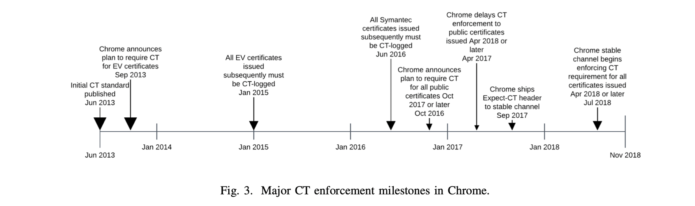

## Does Certificate Transparency Break the Web? Measuring Adoption and Error Rate  S&P’19

### 文章概述

自2013年提出开始，Certificate Transparecy (CT) 这一用于快速发现恶意或误用证书的策略已经被广泛部署了。研究者通过分析Chrome Browser用户的错误log，对目前CT的部署、实现情况做了分析。同时，如何大规模地执行一项新的安全策略而对现有系统尽可能小地造成影响，是安全社区长久以来一直面临的问题。本文也以CT为例进行研究，旨在汲取经验、吸取教训，为后续其它安全策略的推广提供参考。

全面推行CT是不太容易的，而目前部分浏览器也只是“partially”执行了CT，因为如果一遇到CT不合规的证书就报警，（由于可能会频繁出现），也许就会对用户造成告警疲劳（“狼来了”的故事）。本研究发现，CT已经获得了广泛部署（超过60%的web HTTPS traffic 支持CT），CT策略很少导致breakage（即使发生了CT要求更新），但是在除了Chrome之外的其它浏览器中，CT的检查是相对滞后的。

主要贡献：

- 测量了CT部署率（较高），分析了其能够被成功部署的原因
- 分析了用户遇到CT相关的证书验证问题的频率（不高）以及其遇到相关问题之后会采取的行动（倾向于采取某些不安全的措施，e.g., 忽视告警继续访问）
- 分析了CT策略可能面临的一些风险问题

### 背景：CT and Deployment in Browsers

Certificate Transparency

- Logging 证书一般由CA提交到log，在向log寻求证书验证的时候，log会返回Signed Certificate Timestamp（SCT），SCT是用log的私钥签名的
- SCT validation SCT是证明某个证书已经被log/或即将被log的凭据。一般通过三种方式发送：直接嵌在证书内（如果签发证书的CA支持CT，这就是最好的方式，对于website owner来说最方便）；在TLS扩展中提供（需要website owner进行配置，即使签发证书的CA不支持CT，通过这种方式也可以部署）；由CA写在OCSP中（要求server支持OCSP stapling而且CA可以在OCSP的回应中提供SCTs）浏览器也会有自己的CT-policy配置，规范了验证过程
- Monitoring/auditing CT logs提供了REST API支持anyone监控证书的log状态（详见RFC 6962[a]）

CT在浏览器中的部署

- Chrome循序渐进地增强了对CT的要求：2015年初开始对EV的证书强制要求CT；对某些曾经出现过问题的CA强制要求CT；2017年9月开始网站可以自行配置强行要求CT；最新的策略是，2018年4月30日之后签发的证书必须部署CT
- 除了Chrome之外的主流浏览器，如Microsoft Edge和IE、Apple Safari、Mozilla Firefox都推出了一些相关的策略（但是是partially执行CT或者只是给出了计划、没有直接执行CT），其对CT的支持基本都落后于Chrome

### 数据集

- chrome usage metrics（默认开启的）
- certificate error report （opt-in，在客户端出现error的时候征求用户意见上报）
- 主动扫描（基于google bot），以观察服务器是否支持CT。扫描的范围包括Alexa top 1w和chrome的user experience report里的网站
- CT log
- chrome product help forum 收集用户提出的问题（通过问题描述可以观察到，用户发现出现CT error之后采取了何种行动）

### CT相关的数据分析

具体内容比较boring，一些take away message：

- 整体来看CT合规的比例很高（99.5% in Sept. 2018）
- 对于chrome来说，对于SCT的支持没有显著影响chrome的性能和实用体验（SCT验证的中位数是1.1milliseconds）
- Performance issues in Firefox 但是CT在客户端的实现也不是非常容易的。如firefox曾经支持过CT功能，但因为代码实现不是很好，导致性能被严重影响，该功能又紧急暂停了
- 根据论坛中用户的描述分析，绝大部分用户对于CT的了解很少（poor experience）
- major player的推动，例如chrome和cloudflare，对于CT的成功部署是很重要的
- 作为对比，由于实在是难以部署，HPKP协议就失败了（chrome已经不支持）

### My comment

- 本文的主要结论是积极的，即CT已经被很大范围内正确地部署，而且默认chrome已经将CT的校验功能实现地很好（还举出了firefox实现不好的例子）
- 关于CT在除“PC端chrome”之外的其它客户端（如，PC端其它浏览器，移动端，其它任何使用TLS的client）实现地如何还没有讨论（有讨论的必要么？not sure）

### Reference

[a] RFC 6962. https://tools.ietf.org/html/rfc6962