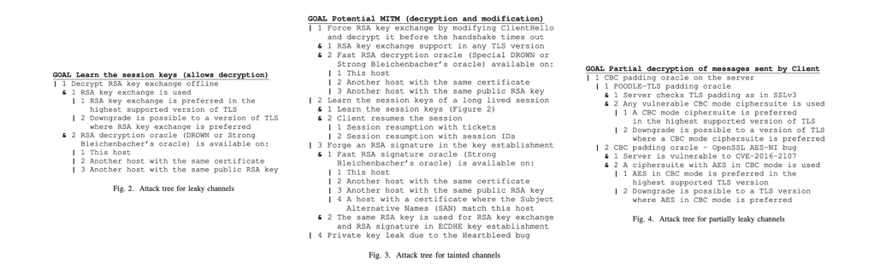
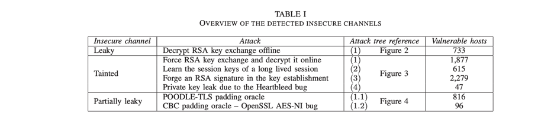

## Postcards from the Post-HTTP World: Amplification of HTTPS Vulnerabilities in the Web Ecosystem  S&P’ 19

### 工作概述

近年间HTTPS不断漏洞爆出，虽然经过多次修补，但现实中网站对于HTTPS的部署可能是混乱且复杂的。本文对由于密码学而导致的web应用安全问题做了一次量化测量研究，选取Alexa Top 10k的网站作为研究对象，对网页的完整性、认证过程以及网站追踪方面的安全性做了分析。结果表明，有相当多的网站由于其嵌入的或者相关的域名没有进行充分的安全保护而面临被攻击的危险，进一步印证了由于web ecosystem的复杂性，其实很难对漏洞进行完整修复。

本文通过梳理TLS相关攻击树[1]的方式，爬取了Alexa top 1w的网站，包括其所有的依赖域名（提供子资源的、子域名），对可能的TLS漏洞进行了分析。主要贡献为：

1. 对TLS相关攻击的梳理，着重于其practical impact，作者称是目前最系统的梳理，可以为相关领域的工作者提供参考。（类似于sok）
2. 构建了一个分析平台，基于所梳理的攻击类型对网站进行检查。
3. 主要关注三种安全问题：页面完整性、认证过程以及网站追踪，对发现有问题的网站做了分析。

### 背景知识

- TLS协议：分为记录协议、握手协议、密钥交换协商协议、告警协议四个子部分
- 针对TLS协议的攻击：降级攻击、RSA解密、RSA signature oracle、Advanced RSA padding oracle、CBC mode padding oracle、Heartbleed

为了更好地理解TLS漏洞将会对web application造成怎样的安全威胁，作者将insecure channel分成了三个等级：

- Leaky 攻击者可以decrypt所有的网络流量
- Tainted 为攻击者提供了MITM的机会，可以解密并篡改流量。
- Partially leaky 有一些侧信道的问题，可以让攻击者对部分的secret数据进行解密。

三种类漏洞的攻击树（文中详细分析了每一种攻击路径中，attacker需要获得的条件（或者利用的已有攻击））：

### 实验设计

步骤如下：

1）利用Puppeteer[2]对网站进行爬取（DOM、cookies、以及所有的子资源包括源码、图片、字体资源等）

2）通过CT枚举每个domain的subdomain

3）利用一些已有的分析工具（testssl.sh[3], TLS-Attacker[4]等）进行检测

4）将分析工具的output map到攻击树并对存在的安全问题进行分析

### 实验结果

作者按照三种安全问题：页面完整性、认证过程以及网站追踪，对发现的问题进行了分类分析。每一类问题又细分出了不同的实现形式以及具体的判断标准（标注在括号内），例如page integrity出问题的方式包括Compromisable Page（页面从tainted channel加载、页面包含没有使用SRI的请求）、Blockable Request（通过<image>加载图片或者通过<video>/<source>加载video）等。

实验发现，几乎将近10%的homepage都还由于复杂的web部署环境而存在被compromise的风险。take way message：大部分的网站开发者对于TLS密码学相关的漏洞不是特别重视（因为修复本身其实不是特别困难）。作者已经对发现漏洞的网站都做了汇报，截止发稿时，文章中“具体提到”的问题都基本已经被修复了。

### My comment

1. 作者将TLS相关的问题做系统性的梳理，并将测试结果map到其对于practical impact的三种分类，能够帮助读者更清楚地了解目前TLS ecosystem implementation中仍然存在的问题及其影响范围，是有参考意义的。
2. 对其它领域的漏洞是否也可以做类似的事情：step1 漏洞梳理（攻击树整理） step2 漏洞测量（可以借助已有的分析工具） step3 威胁分析（需要梳理具体的威胁模型）

### Reference

[1] Attack Tree. [https://zh.wikipedia.org/wiki/%E6%94%BB%E6%93%8A%E6%A8%B9](https://zh.wikipedia.org/wiki/攻擊樹)

[2] Puppeteer. https://github.com/GoogleChrome/puppeteer

[3] Testssl.sh. https://github.com/drwetter/testssl.sh

[4] Systematic Fuzzing and Testing of TLS Libraries,” in *Proceedings of the 2016 ACM SIGSAC Conference on Computer and Communications Security CCS'16*.

