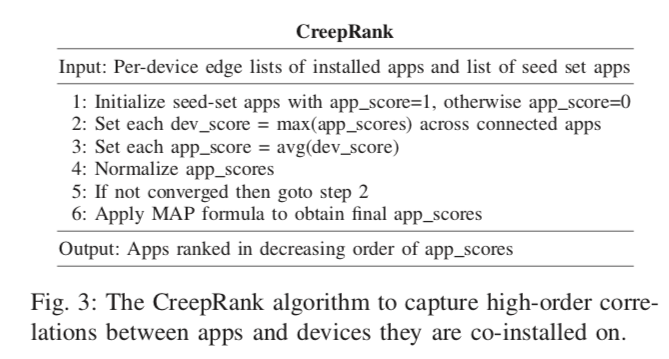
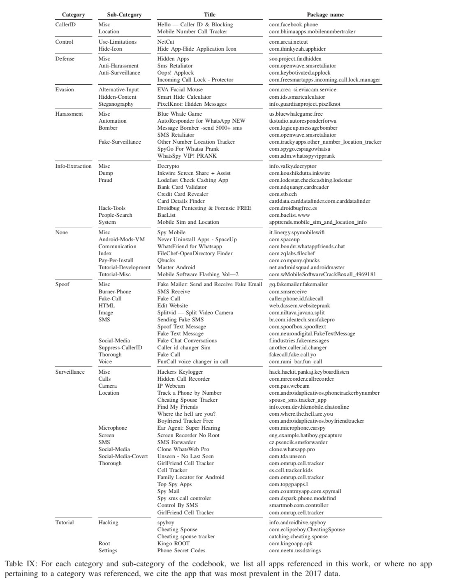

### The Many Kinds of Creepware Used for Interpersonal Attacks

#### 摘要

Creepware，基于人际关系的诈骗软件，是本文研究的对象。作者基于一个提供了超过5千万安卓用户app安装信息的数据集，设计了CreepRank算法，能够根据关联关系挖掘出未知的creepware，并已经帮助Google Play成功下架了上百个app。

#### 主要贡献

* 设计了CreepRank算法，能够高效地（与其它基于图的算法相比提高了2.8x倍）挖掘creepware，并且进行了一次大规模的测量。
* 通过对creeprank识别出的top 1k app进行人工认证，发现了新型的creepware，并对当前该生态的分类做了重新的讨论。（new insights）

#### 数据集

* 主要数据集由Norton移动安全App提供，包括用户设备安装每个app的 <package name，时间>。

+ 辅助数据集：Norton提供了多年来累积的Google Play中被下架的app的信息，包括id、title、description、permissions。

##### 数据预处理

* 移除fake user（安装app此处太多的，可能是安全研究者或者开发者）
* 移除most prevalent app（会影响算法精度）
* 移除devices with only one installation

#### CreepRank算法

##### 假设

* Hypothesis: guilt by association (GBA) 即被安装在已经感染了恶意软件的设备上的app也很有可能是恶意的
* 通过前人(Chatterjee)关于伴侣监视软件的研究数据观察，上述假设是有一定道理的

##### 具体流程

1. **选择种子集合**。选用Chatterjee的18个 overt surveillance apps。
2. **初级算法**。先利用seedset，标记infected devices集合。随后根据app安装在infected device上的概率推断其是否属于malicious app.devices看做结点，app也看做结点。某个app被安在k个infected devices上概率P(k,n)的计算方式是，首先根据先验知识，即该app被安装了多少次，其关联的主机有多少是infected，计算出其一次安装命中infected device的概率，再根据二项分布计算P(k,n)。
3. **加入误报抑制**。如果简单采取初级算法，可能会有误报现象，即某app只被安装了一次，且安在infected device上，此时其概率P为1，但事实可能是非常不准确的。本文用到**<u>Maximum A Posteriori（MAP）</u>**的方法对该步骤进行了修正。简单来说，MAP是在可已知参数的先验分布时，参考先验分布给出后验概率计算（而不是简单的MLE）。具体可参见知乎解释：如何通俗理解 beta 分布？ - 小杰的回答 - 知乎
   https://www.zhihu.com/question/30269898/answer/123261564 , 讲解地非常清楚）。本文中参数的先验概率采取了至少安装在100个devices上的app进行计算，得到了beta分布中的参数，并以此计算出了app的MAP分数。
4. **关联关系挖掘的具体步骤**。进行了10轮迭代，获取stable的初始分数，然后实行MAP算法。
5. **实际部署**。部署在AWS Spark进行分布式计算。

#### Categorizing CreepWare

这里重点说一下本文手工打标签的过程。手工验证了排名前1k的app，找了四个coder进行人工讨论分类，通过分别标记25，25，25，25，35个apps并每次都讨论修正一次分类标签的方式进行。两轮讨论后定下的category标签，在后续60个标记中得到了0.77的**==Fleiss’ kappa 统计系数==**（该参数可以用来评估对于这种人工投票判断属性的系统是否substantial）。随后就决定用此时商定的标签，对余下的890个也做了分类标注，展示如下：

#### Evaluation

与以往的研究做了对比

#### 该工作的亮点

* 创新性的算法
* 手工打标签的过程值得学习

#### 该工作的不足

* 其实思路比较直接，在以往根据图关系挖掘malicious app的工作中可以见到类似的，个人觉得更像是从已有的seed set出发，挖掘恶意软件，然后发现其所得到的恶意软件集中于人际关系诈骗类，于是起了一个名字叫做creeprank...

#### If i was the author

* 尝试变换seedset，挖掘更多malware
* guilt by association的思路也许可以在其他地方加以借鉴
* 发现的一些新型诈骗软件背后的ecosystem也许值得一看

