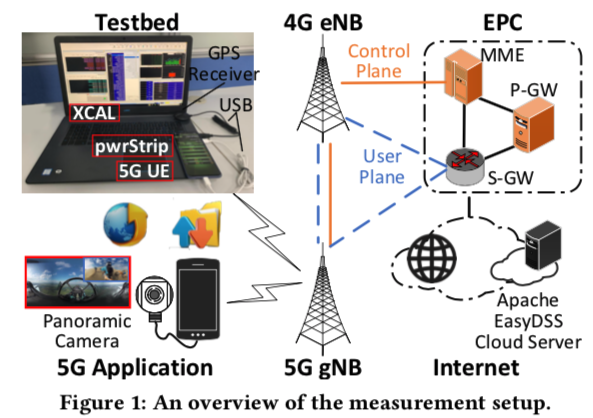

### Understanding Operational 5G: A First Measurement Study on Its Coverage, Performance and Energy Consumption 

#### Key Message

首个针对5G部署的测量：

1. 物理层的信号质量、覆盖率以及切换的表现
2. 端到端的吞吐量、延迟
3. 5G应用的服务质量
4. 智能机的能量消耗

#### Main Findings

5G link能够达到理想的吞吐量，但是TCP利用率低、延迟高所以服务质量不佳，耗电量是4G的2-3倍；上层以及相应的硬件架构应该做出一些调整，以适应5G架构。

##### 测量环境

1. UE：ZTE Axon 10 Pro（Qualcomm Snapdragon TM 855），HUAWEI MAte20 X（Hisilicon Kirin 980），HUAWEI Mate30 Pro (Mali G76 | Hisilicon Kirin 990)
2. Server：在HUAWEI cloud server进行测试
3. 环境：campus region

##### 测量工具

1. XCAL-Mobile 用来解码5G的signaling information以及物理层的一些信息的测量
2. iperf3 + wireshark 用来进行TCP tracing
3. traceroute 端到端的延迟测量
4. 360TEL + Chrome developer 进行页面加载和视频帧传输速度的测量
5. pwrStrip (custom-built tool) 通过读取安卓的内核信息来获取用电量等信息