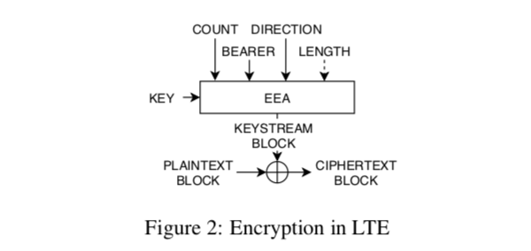
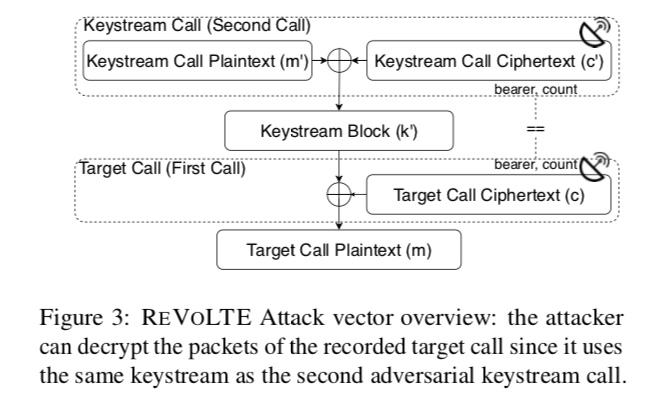
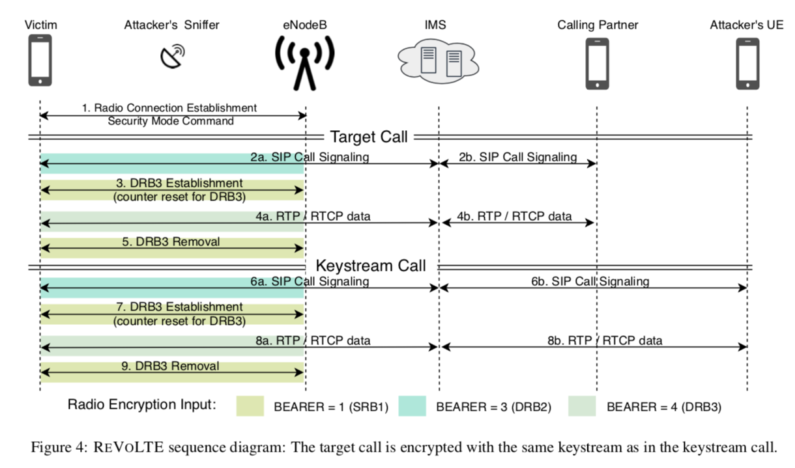
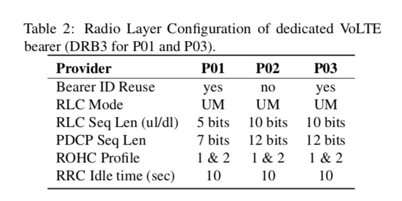

### ***Call Me Maybe:*** **Eavesdropping Encrypted LTE Calls With R**e**V**o**LTE**

#### 概述

VoLTE是被广泛部署的基于包交换的电话通信服务。ReVoLTE攻击利用了运营商在部署VoLTE时由于密钥重用缺陷，导致攻击者可以对通话内容进行窃听。文章对该攻击在真实场景中进行了验证（解决了攻击步骤中一系列工程性较强的技术挑战），分析了该攻击存在的root cause并提出了相应的防御建议。

#### 背景

##### LTE Security

LTE在完成AKA（双向身份认证）之后，会对Radio Layer进行加密。使用流密钥。决定流密钥的几个关键参数是Count，Bearer，Direction。根据3GPP标准[1]，eNodeB应该避免keystream reuse。但3GPP只是要求这样做，并没有说明如何部署避免keystream reuse，真实世界中有些运营商没有进行部署，导致可以进行ReVoLTE攻击。

##### VoLTE Security

VoLTE在LTE安全保护的基础上采用了额外的安全策略进行保护。但有些是optional的。例如本文作者通过测试（三个运营商）发现没有进行media plane的protection。

#### ReVoLTE 攻击描述

##### Attack Concept

由于运营商在同一个bearer中使用重复的密钥流，攻击者需要先对攻击的对话内容进行监听，随后在该对话结束之后向victim发起通话，保持足够的时长（以获得可以完全破解上一个通话的长度的密钥流），随后利用已知明文xor获取keystrea，再利用keystream decrypted已经监听记录的上一个通话的内容。

##### Attack Procedure

Step1：监听（利用SDR）

Step2：发出call（利用COTS Phone），需要了解victim的电话号码和position（radio cell）。

具体步骤如上图所示。和之前keystream reuse的一个技术报告中[2]提到的攻击方法相比，本文的方法不需要进行jamming，只需要进行被动监听。

##### 一系列其它技术挑战

* Radio Layer的监听和解码
  * 利用Airscope完成对Radio Layer的解码
* User-plane Key Reuse
  * 因为该攻击要求攻击者发出的call和监听的call属于同一次通话，也就是要在victim完成上一次call但是回到idle状态之前完成攻击。通过实际测试发现，这个可攻击的时间窗口大小大概是10s
* 提取Keystream
* 解码
  * 想要解码的data用着不同的编码模式，会影响解码过程
* Media Encryption
  * 如果IMS和UE启用了additional media encryption（通过SRTP Protocal），就无法完成窃听攻击ile。（然而作者测量发现，运营商并没有启用额外的encryption）
* Robust Header Compression
  * 传输的数据包可能进行了头部压缩。在decrypt的时候，只能使用RTP Payload以及UDP Payload数据对应的keystream
* Plain-text Mapping
  * 由于该攻击需要准确map加密data，所以丢包、重传等现象可能会影响攻击成功率

#### Real-world Experiment

首先进行了一些测量：

上表是会影响攻击的一些移动网络配置的测量结果。P01和P03重用了Bearer ID，可以进行该攻击。

攻击工具：

* Sniffer： SDR（USRP B210）+ srsLTE + Airscope
* UE：Android Phone + SCAT（diagnostics interface）

成功率：可以正确decode 89%左右的监听数据

#### Root Cause & Defense Suggestions

root cause：运营商在实际配置的时候，在同一个bearer中，每一个新的PDCP entity会重置count，导致和上一个通话使用同样的密钥流。

suggestions：切换Bearer ID，切换RRC Idle状态，使用加密后的RTP流（additional media encryption）

#### Comments

##### 优点

1. 发现了real-world的安全问题，有较高的impact
2. 实际implement了该攻击，解决了完成该攻击的一些技术挑战

##### 不足

1. 该问题只是VoLTE部署中一个较为细节的问题，扩展性比较差
2. 完成该攻击实际上需要的门槛还是比较高的（由于存在如文中所述的种种技术挑战）
3. 相对容易防御（修复）

##### If i was the author

0. how did they find the threat? 
1. 扩展研究， 移动通信中类似的密钥管理配置相关的问题

#### Reference

[1] 3GPP. Evolved Universal Terrestrial Radio Access (E-UTRA); Radio Resource Control (RRC); Protocolspecification. TS 36.331, 3rd Generation Partnership Project (3GPP), 06 2011.

[2] Muhammad Taqi Raza and Songwu Lu. On Key Reinstallation Attacks over 4G/5G LTE Networks: Feasibility and Negative Impact. Technical report, University of California, Los Angeles, 11 2018. https://www.researchgate.net/publication/328927054_On_Key_Reinstallation_Attacks_over_4G5G_LTE_Networks_Feasibility_and_Negative_Impact [Online; accessed 02-Mar-2020].

