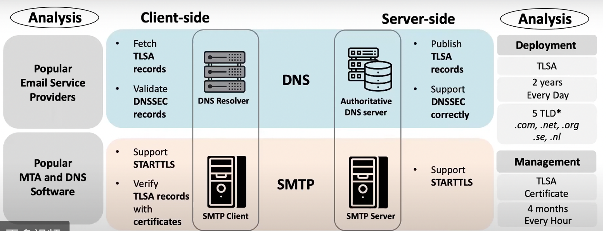
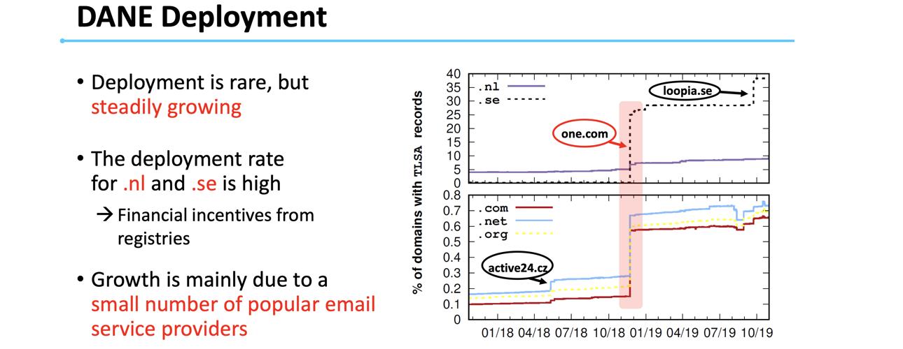

## A Longitudinal and Comprehensive Study of the DANE Ecosystem in Email  USENIX Security’ 20

### 工作概述

本文分析了DANE机制+SMTP在邮件认证过程中的应用现状（部署+实现），是一个测量+数据分析类的工作。

DANE如果在邮件中发挥作用，需要

1. 机制参与：

- STARTTLS（在邮件中支持加密通信）
- DNSSEC 可以保证DANE消息可信

2. 实体支持：

- 邮件服务器支持STARTTLS
- 邮件服务器支持对TLSA记录的验证
- DNS服务器提供TLSA记录
- DNS服务器和客户端支持DNSSEC
- 客户端能够获取TLSA记录并根据DNSSEC进行验证

### 数据收集

- Server-side：获取了5个TLD下所有二级域名在2年内的记录（daily snapshot），以分析TLSA的部署情况(MX records TLSA records)。
- Client-side：调研了29个popular-MTA以及5个DNS software

### Main Findings

* DANE的部署比例相对比较低（百分之0.x的量级），在.nl和.se下的部署率 相对较高。

- DANE被正确部署了吗？

正确部署需要的条件：DNSSEC 提供正确的DS & RRSIG Record， STARTTLS提供和TLSA records相匹配的证书

实验结果：上述records都有一定比例的缺失（missing）和错误（mismatch）

- 从客户端来看，多少popular email service provider支持DANE

自己注册了一个域名用于测试，其中不同的子域名配置了（不同程度错误）的DANE配置。

结果：7/29支持DNSSEC，4/7正确验证了DNSSEC，23/29支持STARTTLS，4/29获取了TLSA records，2/4对TLS provider进行了正确验证

### My Comments

* 一篇中规中矩的测量文章，数据测试和分析都还比较全面
* 启示：也许可以继续尝试DANE在其它方面应用（Web）的测量

