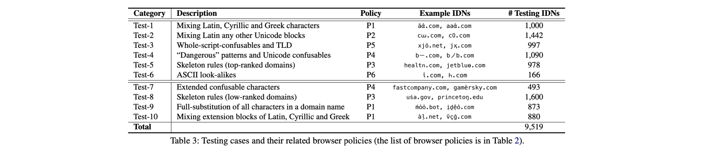
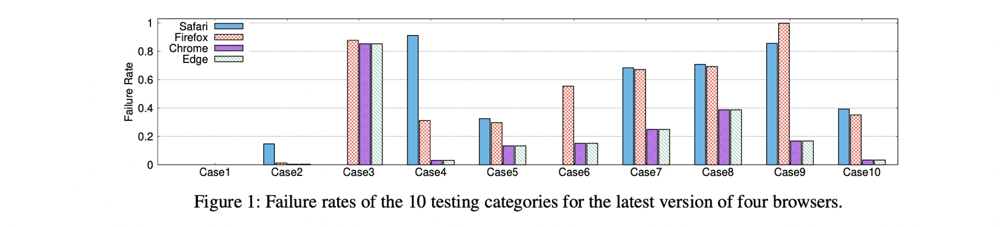

## Assessing Browser-level Defense against IDN-based Phishing  USENIX Security’21

### 文章概述

国际化域名（IDN）及其相关的钓鱼诈骗风险（IDN Homograph）已经被讨论了许久，而主流浏览器也都已纷纷提出了自己的策略以应对IDN域名的风险。本文针对5个主流浏览器（Chrome、Firefox、Safari、Microsoft Edge 以及 IE）以及两个移动浏览器（Andriod Chrome以及iOS Safari）（的多个版本）目前针对IDN的防御策略的有效性进行了测量实验。开发了一个自动测试评估的工具，设计了9000 test case，发现了目前浏览器防御策略中的一些漏洞。本文还开展了一次用户调查（User Study），来了解用户对于homegraph IDN欺诈的一些反应情况。

主要回答如下几个问题：

1. 目前主流浏览器都采取了哪些策略应对IDN域名，实际执行地如何？
2. 有哪些方法可以绕过浏览器的防御策略？
3. 终端用户是否能够识别homograph的IDN？目前浏览器能够防御的IDN和能绕过防御的IDN相比，谁的迷惑性更强？

### 背景知识

Punycode 国际化域名使用了non-ASCII字符，很多tools、application都是不支持的，应对办法就是将IDN转化成punycode编码格式（以xn--开头）。

### 数据收集

从.com zone file中解析出IDN域名，再根据alexa top 1w，参考已有工作[a]（字母相似列表），识别出来1855个IDN homograph。在几个浏览器上进行了测试，发现他们并不能完美地block IDN homograph（即，理论上将以punycode的形式展示IDN，实际上有一些域名被miss了）。

### 针对浏览器的测试

- 浏览器目前的策略。不同浏览器略有不同，大概有不允许某些范围内（可造成混淆）的unicode混用、针对top domain的相似度计算和危险拦截、针对TLD的检测、以及其它的各种黑白名单方法（有的也允许客户进行定制）。总结如下表：

- 测试用例的设计。基本分为两类：1）符合现有的block策略的，观察浏览器执行地如何（1-6）；2）超出目前的检测范围的（因为黑白名单基本上是基于unicode block的，可以选择其它视线范围外的block进行测试）（7-10）。总结如下表：

- 测试使用的工具：
- - 浏览器平台-LambdaTest[b]，自动化地配置Selenium进行测试，支持PC和Mobile浏览器，可以从不同的geo location发起访问。
  - OCR识别（从截图中判断URL栏显示的到底是什么）- Google Tesseract OCR Tool [c]
- 部分实验结果

### User Study

提到了详细的设计user study的原则，参考文献[d]. 实验室在亚马逊的众包平台MTurk上进行。为了更好地设计实验范围，还进行了预实验（Pilot Studies），选定了不同的影响因素进行控制变量试验，随后又进行了回归分析，讨论各种因素（IDN是否已经处于被浏览器block的范围内、网站的类型、网站是否popular、用户的网龄、计算机背景、年龄、教育程度等）对结果的影响。

### My Comment

1. IDN homograph其实是个老话题了，这篇文章主要胜在测量实验和user study做得比较全面，没什么硬伤。
2. 本文使用的几个工具（浏览器在线自动测试、OCR、user study众包平台）以及设计user study的方法（必要的套路）是值得借鉴的。

### Reference

[a] HiroakiSuzuki,DaikiChiba,YoshiroYoneya,TatsuyaMori, and Shigeki Goto. Shamfinder: An automated framework for detecting IDN homographs. In *Proc. of IMC*, 2019.

[b] LambdaTest. Lambdatest: Cross browser testing cloud, 2020. https://www.lambdatest.com/.

[c] Google.Tesseractorc,2020. https://opensource.google/projects/tesseract

[d] StuartSchechter,RachnaDhamija,AndyOzment,andIanC Fischer. The emperor’s new security indicators an evaluation of website authentication and the effect of role playing on usability studies. In *Proc. of IEEE SP*, 2007.