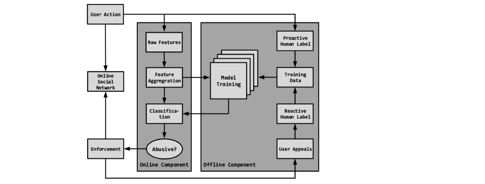
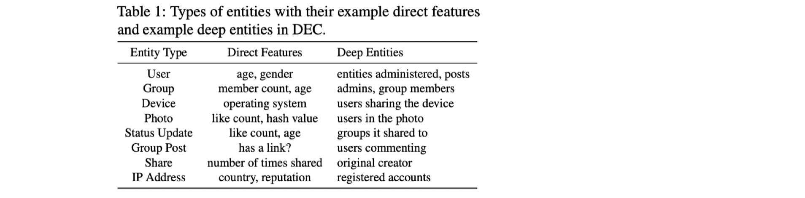
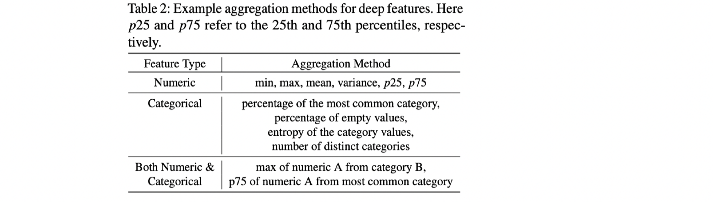
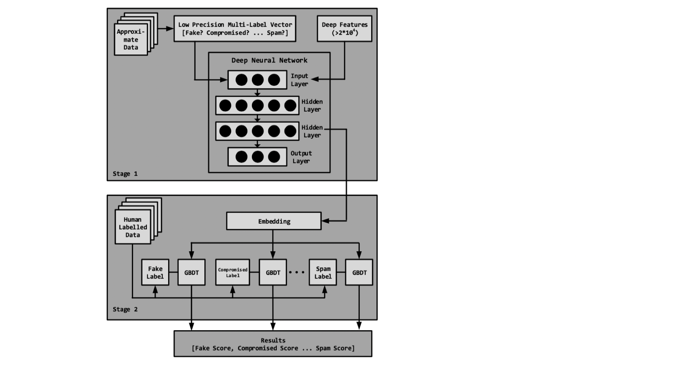
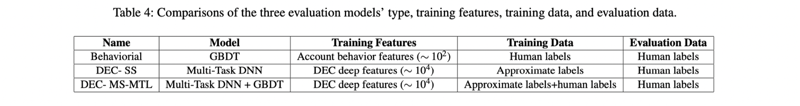
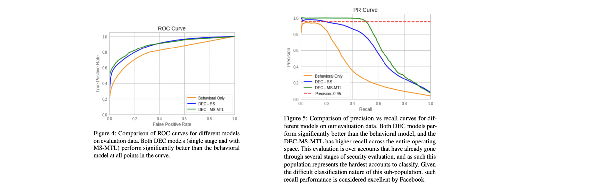

## Deep Entity Classification: Abusive Account Detection for Online Social Networks   USENIX’ 21

### 文章概述

传统对社交网络abusive account的检测方法依赖于特征工程，容易被绕过。本文作者提出了一种多阶段多任务（MS-MTL）的深度学习模型，可以利用少量的高精度的人工标注数据和大量低精度的自动标注数据，对于多种不同的abusive account进行精准分类。结合多种采样和重分类方法，降低模型的负载，可以将检测扩展到10亿级别的用户。主要利用的原则是：abusive account在社交图谱中展现出的特征，例如网络结构、特性等（即使其能一定程度上control自己的行为，例如发送的好友请求数目等，但是它很难控制自己连接的所有用户的行为）。

该模型面临两个问题：1）社交网络特征维度过高 2）人工能够精确标注的数据较少（不过，可以基于启发式规则，获得大量的自动标注数据，尽管精度较低）；于是作者设计了一个MS-MTL模型，训练分为两个阶段：1）第一阶段，采用大量的自动标注数据进行特征降维的训练，不同的abuse type的account被formulate成不同的learning task；2）第二阶段，用第一阶的特征表示作为低维特征，进行第二阶段的训练，对每个task都使用高精度的人工标注数据进行微调。

模型在Facebook运行了两年，检测出上亿级别的abusive account，使得整个平台的abusive account的数量下降了27%，本文的主要贡献：

- 设计了该MS-MTL算法，能够提取高纬度特征、完成多类别分类、解决人工标注数据少的问题
- 对该模型进行了evaluation，对比了其它的方法，
- 给出了在FB部署该系统两年间的lessons learned

### Background

Abusive account的定义：虚假的（非真实人类创建）的账号或者可能被attacker利用的真实账号，进行一些abusive 的活动，例如传播spam或者scam信息。

为了规模化地部署应用，检测系统面临着scalability、latency、多种abuse类型检测、误报问题等多重挑战。本文模型分为两部分：

- Online Component 捕获用户行为、提取原始特征、根据分类结果做出行动
- Offline Component 进行模型的训练、调整，训练模型是一个多任务模型，人工标注数据来自于主动标注（专家经验）以及被动标注（用户举报），会定期对模型的训练进行更新（以适应最新的abuse特征）

### Method: Deep Feature Extraction

Deep feature是指，提取该节点在网络中的所有连接entity的特征，因为这些特征不仅很好地体现出了该节点在社交网络中的信息，还不容易被绕过。

实际应用中，本文计算了大量的“聚合特征”（Aggregation特征），对numeric的特征和categorical的特征做了不同的聚合处理：

例如对于数值特征，计算min、max、mean、方差p25、p75；对于类型特征，计算最大类的比例、空值的比例、熵值、类别的总数；综合考虑，还计算了类似于种类B中出现最多的数量特征A等等。

但是，该特征提取过程对于上亿级别的图来说，负担还是很重；因此，在实际部署的时候，模型采用了多种方式来降低计算量，例如：为每个账号记录“冷却期”，简单来说，不是定期对每个账户都重新进行分类，那些已经被多次检查证明良好的账号，重新被利用成abusive账号的可能性较低，所以检查的频次会设置地更低一些；类似的，新注册的账号其实被abuse的风险更大，所以对新注册账号的检查频次更高；又例如，如果某个账号的关联entity太多，会对entity进行抽样之后计算特征。

### Method：Multi-Stage Multi-Task Leaning

多任务：每种abuse类型算作一个task，每个样本的label是一个bool类型的向量（因为abuse类型之间不是完全独立的）

需要解决的挑战：1）特征维度爆炸问题 2）缺少高精度的训练数据的问题

方法：采取多阶段训练的方法，在第一个阶段使用低精度的启发式标注数据（本文中，约3千万）进行训练，使用第一个阶段的最后一个hidden layer的向量作为第二个阶段的特征，在第二个阶段利用高精度的人工标注数据（本文中，约24万）进行调整，这样既完成了降维，又充分利用了训练数据。

### Evaluation

从FB的active user中抽样了3w个进行人工标注&作为evaluation dataset。对比了DEC-MS-MTL以及其它两个更简化的版本，设置如下：

实验结果：

### Discussion: Lessons Learned

- 减少计算负载&人工任务。对于图模型的特征计算、处理往往是负载很高的，本文通过多种方式，例如尽最大可能地利用已经计算出的特征、进行采样、设计更新式的计算规则等等降低计算负载，不过，DEC的运行CPU负载仍然占到了FB所有业务的0.7%。但与此同时，由于DEC的应用，已经大大提高了FB进行abuse account审核需要投入的人力资源。
- Segmentation and Fairness。FB是一个Global使用的应用，训练是非常有可能存在bias的（无论是年龄、性别还是国家等）。为了解决该问题，本文目前采取的方式就是扔掉所有的直接特征（可以认为是一阶特征），而选用deep特征（可以认为是高阶特征），考虑就是，即使在绝对的数值、一阶的特征方面有所差别，但是abusive account在社交图谱中的行为特征（高阶特征）是类似的。作者正在实践的其它方法包括抽样（但因为用户太多样，细层次的抽样很难实现）以及为不同的segment设计不同的模型（需要累积充足的数据）。
- Limitations
- - 基于图的计算仍然十分昂贵（即使已经想办法减少了计算负担）
  - 检测思路基于账号关联的FB账号（如果abusive account关联的FB账号较少，则会检测不准确，但该类账号理论上对FB的影响也会较小）
  - 模型缺乏可解释性，使得DEC其实很难调试，也很难理解背后的原因
  - 使用聚合特征，对outlier的敏感度低，使得一些拥有极端数值的outlier其实很难被发现。在实际应用中，该系统还采用了一些其它的方式，例如难过过人工规则捕获极端值的方法来改善这一问题，不过，如何在DEC中应用，还未得到解决
  - DEC和其它监督/半监督学习一样，严重依赖于训练数据标签的质量，存在训练数据被污染而干扰结果的可能性。目前，正在对数据标记过程进行加强，努力发现潜在的威胁

### My comment

- 我觉得这篇文章很不错，如何在实际环境中将安全检测算法大规模地、可更新地使用起来，如何在亿级别用户的环境中实现图检测算法，如何解决标注数据过少的问题，都给出了行业领先的解决方案
- lessons learned聊的内容也挺实在，在ML模型的应用、工程问题的解决方面具有很好的参考价值