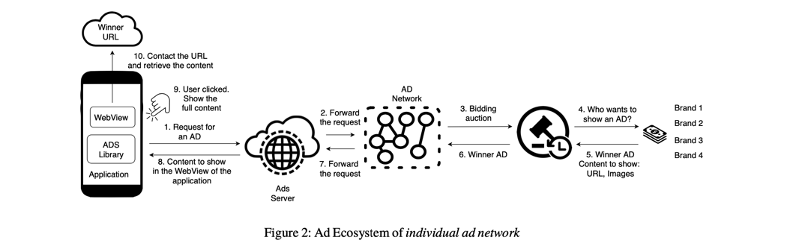

## Towards HTTPS Everywhere on Android: We Are Not There Yet USENIX Security’20

### 文章概述

近年来，针对安卓系统，google部署了一系列的安全机制，包括KeyStore以及Network Security Policy（XML-based configuration file）。本文对这些防御措施的有效性进行了研究。从Google Play爬取了一些应用（125k）进行了分析（由于实验之间Google推出了更加严格的执行要求，在第一次分析后又爬了一次数据，repeat实验进行对比）。结果表明，部署的比例不是很高，而且部署存在一系列的问题。作者对root cause进行了分析，结果显示app的开发者从一些知名的开发网站进行复制粘贴一些有问题的policy，以及许多popular的一些ad library要求app降低安全标准。

主要贡献：

- 对Google推出的安卓安全防护策略做了详细的分析，给出了它的优势和可能存在的坑。
- 在125k app上进行了研究，发现部署率低且部署地有问题（e.g., NSP部署了但仍然允许cleartext通信）
- 对root cause进行了分析，提出了一种drop-in的NSP的拓展，能够使得developer尽管使用了某些第三方库但不会因此降低安全配置等级

### 背景：Network Security Policy

- 内容

通过XML文件定义，可以对cleartext、certificate pinning、keystore and ca进行配置，以及可以配置某种debug模式。从安卓7.0开始要求支持NSP，如果有missing file/field则会apply default配置。不通API-level的默认配置略有不同（文中给出了详细的配置）。

- Weakness

允许设置cleartext、允许override certificate pinning、允许信任user CA store（对绝大部分app来说是没有必要的，如果有信任某个ca的需求，直接在NSP里配置证书pinning就好了）

### Policy Adoption

- 数据收集

根据Andriod Rank[a] 选择下载量最多的app进行研究，从19年的6月到7月爬取了125k个app。首先进行了聚类分析（normalized XML文件，例如替换所有的证书hash->"HASH”）。发现有6%部署了default的policy，6.9%部署了新的policy。

- 发现

1. 97.5%部署原始版本的policy的app允许cleartext protocol
2. policy for 127.0.0.1 研究发现是在使用一个Facebook第三方库的时候，被要求更改支持127.0.0.1的配置
3. 1083 app支持信任user ca
4. [example.com](http://example.com) 即，一些policy是直接从开发网站样例中抄过来的（甚至域名也没改）
5. 102 app支持key pinning，但起码其中有9个用地有问题（override功能）

由于19年1月份的时候谷歌进行了一次policy更新，要求所有的新的app都必须forbid cleartext。所以又重新爬了一遍数据。结果就是：有提升（部署率、正确程度）但问题仍然存在。

- Android Networking Libraries Adoption

注意到，配置文件的设置和程序函数库实际的执行还是两回事。也就是说，即使配置文件做了要求，安卓的具体函数库在执行的时候是否遵循了配置文件呢？

1. 安卓的官方开发文档只是“强烈建议”开发者遵循该配置文件。
2. 大部分库是拿不到源代码的，只能进行黑盒测试。

基于以上两点事实，本文开发了一套测试框架，对10个流行的app库进行了测试（URLconnection、BasicHttpClient等）。

首先针对NSP的规则生成一系列的XML（不同的配置类型），其次生成了三种不同的“测试环境”：1）只是测试，不做MITM 2）模拟了MITM 3）攻击者利用在userCAstore里安装的custom CA进行MITM。通过观察运行结果判断library是否执行了NSP配置。

结果发现了一个库 AndroidAsync完全不支持NSP，但是其他的库居然都执行地很好（surprising positive）的结果，原因是它们都没有自己实现SSL-TLS相关的部分，而是直接借助了一个安卓的核心库Conscrypt（而该库的实现是安全的）。

### Impact of Advertisement Libraries

广告往往是app收益的重要来源，但由于其自身的实现机制，有的时候广告内容不得不以http的形式来呈现（也因此降低了app的安全等级）。本文对广告库相关的NSP进行了系统分析。

根据AppBrain[b]的排名，选取了29个ad library进行研究。包括支持cleartext、是否信任userCA、对NSP策略修改的透明度（是否向开发者说明修改NSP的细则及目的）、以及这些库目前被app的使用情况（借助state-of-the-art的静态分析工具 LibScout[c]进行）。

### NSP Extension

由于第三方库可以弱化app的NSP，而要求广告库“做得更好”是不太先现实的。所以，本文还提出了一种NSP的扩展，即，使得其支持对不同的库定义不同的NSP配置（例如，广告库的http要求可以只影响其本身，而不影响整个app），文章还对该extension的部署、向前兼容性、limitation等进行了分析。

### My Comment

1. 安全策略的细节（演进历史、针对不同版本的具体要求）、理论上存在的问题（纯粹的分析）、实际部署（测量工作）、配置文件的实现+函数库如何执行配置文件+app如何应用函数库 的整个过程，都是可以写paper的，也是本文cover的内容，值得我们借鉴。但是，文章结构感觉组织地不是很好（没能high-level地给出NSP从制定到部署到实施的整体流程分析，对研究的各个章节的定位有点问题）。
2. 个人觉得最有趣的部分是Policy Adoption一章中关于library执行NSP策略的自动化测试框架。有时候很多研究问题，遇到黑盒的情况（看不到源代码）可能就放弃了，但设计自动化测试框架、利用黑盒的方式进行测试还是蛮实用的，值得借鉴。然而遗憾的是文章对该框架的细节没有做过多介绍（我不成熟的猜想，其实实现这样一个框架也比较困难，可能是实现地并不特别“漂亮”，比如自动化的模块cover地不是特别好，还是需要加入许多人工活，所以没有将该框架的设计、应用作为重点介绍，也没有release框架的code）。

### Reference

[a] AndroidRank, open android market data since 2011. https://www.androidrank.org. 2011

[b] AppBrain. AppBrain: Monetize, advertise and analyze Android apps. Ad Networks. [https://www.appbrain.com/stats/libraries/ad-networks.](https://www.appbrain.com/stats/libraries) 2011

[c] Michael Backes, Sven Bugiel, and Erik Derr. Reliable Third-Party Library Detection in Android and its Security Applications. In *Proceedings of the 2016 ACM SIGSAC Conference on Computer and Communications Security*, 2016.