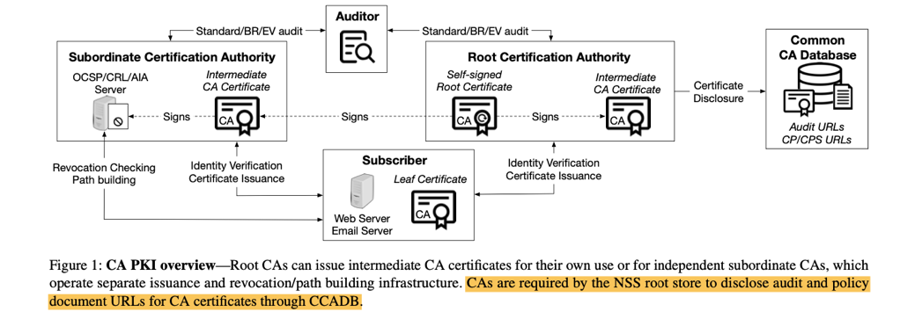
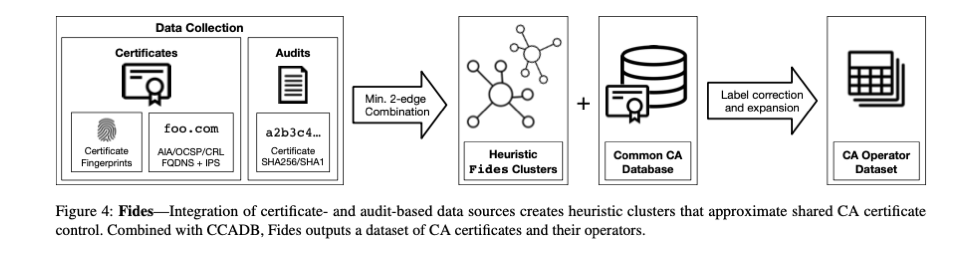

## What’s in a Name? Exploring CA Certificate Control  USENIX’ 21

### 概述

根证书所属组织的识别，对于Web PKI的安全管理是相当重要的。已有的工作通常通过根证书中的Subject Organization识别CA，然而，由于证书标准并未对该字段进行严格规定，而且CA组织之间也可能出现转让、撤销等种种操作，其实根据该字段识别是不准确的。

本文以CCADB（Mozilla的CA信息库）为ground-truth，从CA证书的 所签发证书的ASN.1 fingerprint、网络服务器关联性 以及 Audit（监管信息）的关联性三个方面出发，对证书的operator进行了识别，更正了CCADB的一些错误标记，并扩展标记了一批CA的ownership。其标注结果已经公开至github[1] （6849个证书，本工作将识别operator的粒度精确到了intermediate CA，6K中绝大部分为intermediate数据）。

### 背景

由于CA机构之间存在较为复杂的组织并购、中间证书签发等合作关系，想要找到CA证书的“control”来源，需要首先对“control”进行明确定义。本文考虑的CA证书不仅包括根证书，还包括中间证书。作者定义“持有证书”为：拥有对该证书的操作，即使用公钥，的权利，又即，通过subject+subject publickey identifier （SPKI）来标识“单个”证书，但“subject”字段指向的组织并不一定直接代表着持有该证书的组织（e.g.，在移除对semantic证书信任的过程中，chrome 通过手工检查的方式，对来自8个不同的subject organization的根证书放入blacklist，而其中7个的subject字段都和sementic没有直接关系）。

CCADB——Mozilla维护的根证书信息库。Mozilla维护独立的root store，想要加入该store的CA必须提供具体的信息，以及对mozilla根证书要求的合规审核证明。CCADB提供了根证书的持有者信息（但没有cover到所有的根证书，因为mozilla的root store也只是所有“publicly trusted root”的一部分）。本文将CCADB提供的信息作为“potential ground-truth”。

### Fides 原理——如何识别CA Ownership

数据来源：CT logs（获得待标记的，即实际在web pki中被使用的CA证书数据，及其签发的证书链数据）+ CCADB

识别方法：主要利用以下三个特征对CA证书进行归类：

- Fingerprint of leaf certificates. CA签发的证书具体字段内容是非常丰富的，但在证书的数据结构方面存在一定的相似性（因为CA使用的证书签发software/code可能是固定的，或者存在某个有限集合中）。作者利用证书的ASN.1结构树作为指纹，并通过衡量issued certificate 指纹的相似性判断两个CA是否属于同一owner。
- CA network infrastructure. 证书运行系统涉及到了一些重要的网络服务设施，其中一些是和证书的owner相关的，作者选取了AIA CA Issuer、CRL以及OCSP作为分析对象，解析其URL（FQDN、IP以及AS）。作者的claim是，如果两个证书的owner使用同样的network设备（例如CRL信息host在相同的服务器上），则其实际的operator可能是相同的。
- CA audits. CCADB中的证书均带有audits信息（由某个第三方机构提供，对证书的行为合规性进行证明），audits的形式是pdf文件，而且通常不会针对单个证书提供单个pdf文件，而是将某个CA的证书都放在同一份报告中。作者提取了全部pdf文件，转换成text并匹配证书哈希，将两个被同一份audit cover的证书视为可能来自同一operator。

Result & Evaluation: 略，见paper 整体来看准确性不错，召回率（覆盖度）有待增强。

### My comments

1. 一篇不错的文章：1）研究了一个重要问题。CA组织来源的识别确实是证书分析工作中一直比较薄弱，或者说含糊的一环。已有工作几乎都是依据subject字段进行简单归类，而in the wild，有很多证书的subject字段其实不够informative，是无法判断来源的，即使带有明确的信息，正如作者所说，也可能是不准确的。2）选取的feature是比较make sense，而且并不是特别直观就能想到的feature。比如我也看过CCADB的数据，但完全没注意到其中的audits信息。3）工作量足够。本文研究问题的ground-truth非常有限，文中也提到了大量的manual工作，其结果（公开的数据集）也许能为后续的研究节省不少时间。
2. 感觉做这类文章需要比较深的background：1）如果不能深入、系统地理解CA的操作过程、需要满足哪些条件，是想不到本文利用的那几个特征的；2）文中其实在claim自己的feature make sense，或者说描述自己的finding的时候，有挺多的statement其实是缺少citation或者说数据支持的，像是经验性的描述（或许作者认为那些statement就是common sense），也是本文的一个缺点吧。比如CA之间的关系，如果不是staff或者对根证书系统非常熟悉的人，可能是很难找到相关信息的，如果作者能够提供详细的资料来源就更好了。

### Reference

[1] Fides source code/data. https://github.com/zzma/ca-transparency.

