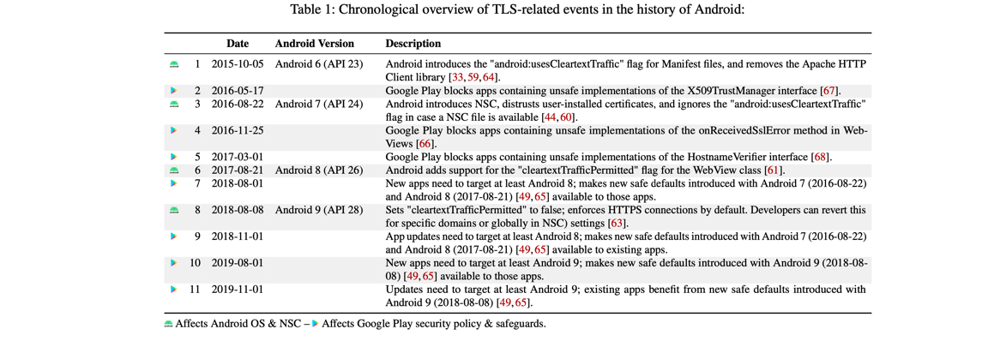
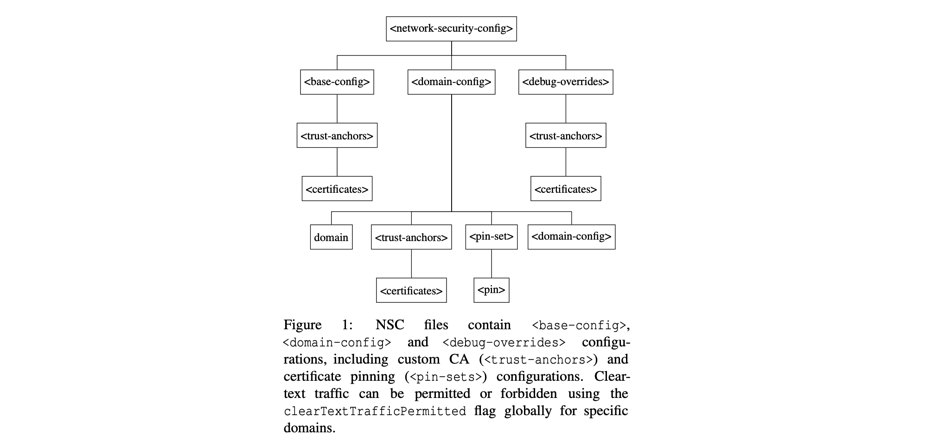
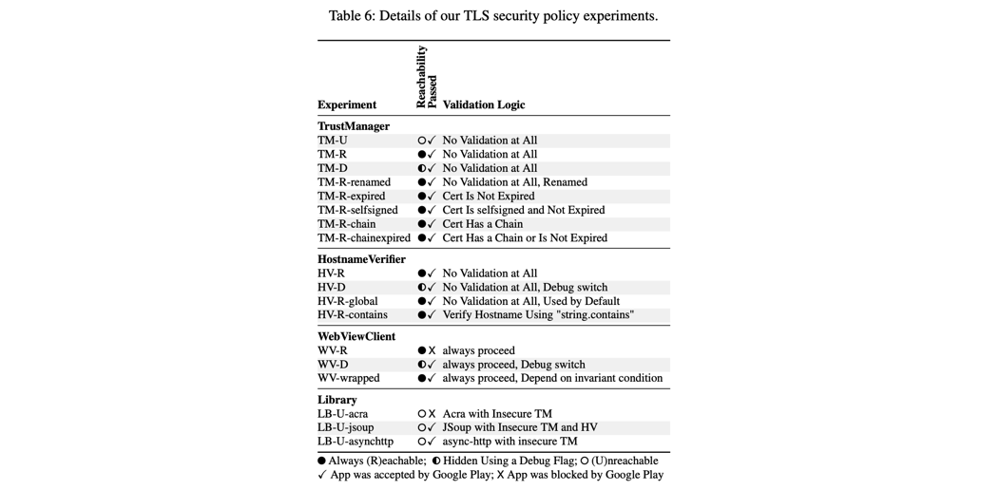

## Why Eve and Mallory Still Love Android: Revisiting TLS (In)Security in Android Applications  USENIX Security’21

### 文章概述

长期以来，大量安卓app由于配置了不安全的TLS证书验证机制导致MITM的风险。因此，谷歌推出了Network Security Configuration （NSC）来增强安全性，并在google play中对app是否仍存在该类风险进行检测（会block风险严重的app）。本文即为对该问题的大规模测量工作，主要关注于：1）已经应用了NSC的app是否真的符合安全性标准（静态代码分析+人工分析）2）google play的检测-block是否有效（通过主动向google play提交存在风险的app来检测。

主要贡献：

1. **NSC adoption and security**. 测量了1.3m google play中的安卓app的NSC部署情况，发现其中99k部署了custom的NSC，发现其中988.87%的安全性和默认配置相比下降了。
2. **Efficacy of Google Play Safeguards**. 检验了google play对TLS安全机制检测的有效性。复现了12年Why Eve and Mallory love Android的工作[a]。发现有5.5k out of 15k的安卓app仍然存在漏洞（有被MITM的风险）。
3. **Discussion and Recommendations**. 对NSC的错用以及Google Play的安全策略进行了讨论，给出了一些建议。

### 背景知识

从Android7开始支持NSC，示例结构如上，可对以下方面进行配置：

1. Cleartext Traffic Support. （也就是对HTTP Traffic的支持），默认是不支持的。
2. Certificate Pinning. 可以自定义证书pinning（无需自己实现code）。
3. Custom Trust Anchors. 从安卓7开始，系统默认是不支持用户安装的CA证书的，但是application可以通过该设置自定义信任CA。
4. Debug Settings. 允许开发者配置debug模式的CA（e.g. 自签，仅用于debug用途）。

但注意，application仍然可以自主实现代码，对NSC的配置进行over write。

关于Google Play的安全检测：从2016年开始对application是否部署了正确的（安全的）TLS配置进行检测，没有披露关于检测系统的更多细节，但确实会进行检测并对检测到不合格的app进行block。

### NSC Adoption and Security

数据收集：利用unofficial的google play python api[b]。爬取了从2016年8月到2020年3月共1.3m的application，发现其中99k部署了custom的NSC，利用obfuscation tool[c]去掉了其中2.8k obfuscated app，对剩余的96k app做了进一步分析。发现的一些问题包括：

- Cleartext Traffic 89k app重新启用了HTTP（有些是global的，有些仅针对部分域名）
- Pinning Certificate Pin出现了一些问题，例如为了绕过某些安全告警pin一些没有任何实际意义的证书，以及设置了不合适的pin过期时间
- Custom CA Configuration 提供了被custom trust的CA列表，也有一些app选择信任用户安装的CA
- Debug Overrides 例如信任了一些不该被信任的CA
- Malformed NSC Files e.g. 在domain字段写入了wildcard domain或者url（都是不在安全准则内的），或者copy了不安全的configuration

上述问题不仅出现在一些unpopular的app中，某些下载量超过100m的app也存在该问题。

### Google Play Safeguard

调研了一些可能会违反safeguard安全监测规定的做法，分成了以上↑四类，分别定制相应的app上传到google play观察是否被拦截。结果如上。

### 一些讨论

- 允许NSC定制化是危险的。
- 证书Pinning仍然存在问题（尽管NSC已经简化了pinning的实现）
- Google Play 的Safeguards是不充分的

### My comment

- 本文其实聚焦的研究范围比较有限，仅仅是对NSC配置的研究，但数据量足够大，分析地也比较全面。事实上没有形成特别有效的recommendation
- 对impact的讨论有质疑，因为作者是以举例的方式来强调其发现的问题的impact（即存在NSC配置问题的app的影响力），而不是统计数据（怀疑统计数据会不太好看）
- 如果要测量”存在哪些不安全的配置“，首先要了解”安全的配置“包含哪些内容，作者做了比较充分的调研工作，这方面给出的信息是很有参考价值的

### Reference

[a] FAHL, S., HARBACH, M., MUDERS, T., BAUMGÄRTNER, L., FREISLEBEN, B., AND SMITH, M. Why Eve and Mallory love Android: An analysis of Android SSL (in)security. In *Proc. 19th ACM Conference on Computer and Communication Security (CCS’12)* (2012), ACM.

[b] Google play python API. https://github.com/NoMore201/googleplay-api (visited on 09/22/2020).

[c] WERMKE, D., HUAMAN, N., ACAR, Y., REAVES, B., TRAYNOR, P., AND FAHL, S. A Large Scale Investigation of Obfuscation Use in Google Play. In *Proc. 34th Annual Com- puter Security Applications Conference (ACSAC’18)* (2018), ACM.