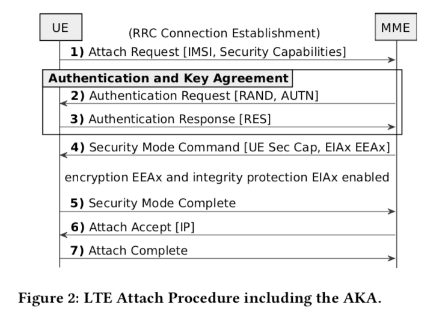
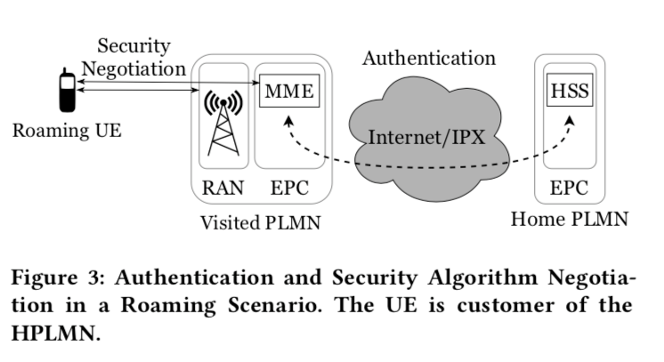
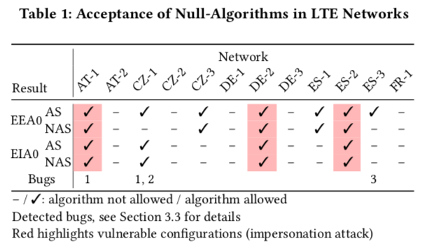
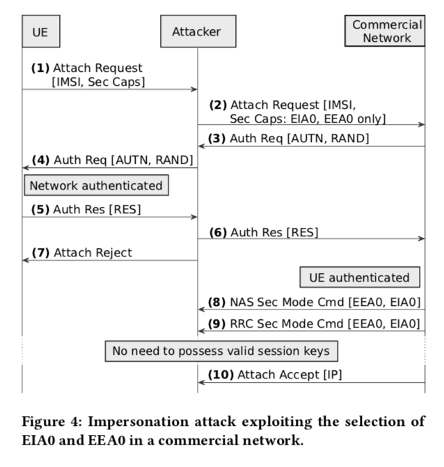

### 2019 LTE Security Disabled—Misconfiguration in Commercial Networks

#### 研究概述

尽管LTE已经增强了许多安全防护，但是在实际的部署中，仍存在因误配置导致安全隐患的可能。以往的研究如果使用商业手机进行测试，是不能更改UE连接RAN过程中的一些配置参数的。本文作者对srsLTE进行了一些修改，使其能够对网络侧关于安全配置参数修改后的响应进行主动测量。测试的12个欧洲商业LTE网路中，有4个存在误配置现象，有3个会受到impersonation攻击。 

主要贡献： 

1. 开发了low-cost的LTE网络安全配置测试工具 
2. 对12个欧洲的LTE商业网络进行了真实环境中的测试 
3. 找到了misconfigured的例子以及进行了proof-of-concept的攻击实现 

#### LTE的安全相关特性 

LTE对UE的管理分为接入层AS（UE与eNodeB）和非接入层NAS（UE与MME）。 

1. 附着过程和AKA 

2. 安全算法。支持加密和完整性保护的算法，EEA和EIA，各有三种算法，其中EEA0和EIA0不提供任何安全保护（为emergency call设计）。一般来说，对于信令层（控制平面）的完整性保护是必须的，加密是optional的（encouraged）。 
3. Roaming 漫游 。漫游可能存在的问题是，home operator对用户进行鉴权，而visited network是实际连接而且要对通信过程安全负责的一方，也就是home PLMN并不知道VPLMN使用了什么安全策略。 
    

#### 测量实验 

本文将attach过程中的安全算法选择作为研究对象，根据3GPP的规定，控制平面的完整性保护是必须遵守的。作者通过修改srsUE的部分流程，使得UE支持non-secure的算法，从而对network在不同安全参数下的响应进行比较完善地测量（否则后续步骤将无法通过）。 

共测试了12个运营商，不可避免地，有些usim会处于漫游状态，但由于漫游状态下接入网的安全性本身也是通过visited network保护的，所以影响不大。 

除了允许不安全算法连接之外，还有三个小bug： 

Bug1. fallback 如果UE声称自己不支持安全算法运营商会默认fallback到EEA0 

Bug2. 对EIA0的赋值变成了EIA7（配置错误） 

Bug3. 有些网络不支持Snow3G or AES （3GPP要求必须支持） 

#### Proof-of-concept Attack 

中间人，降级攻击 

#### Comments

##### 优点

1. 对LTE网络的安全配置进行了主动测试（而不是被动抓包）。 
2. 修改了srsUE的procedure，适应测试实验需求。

##### 不足

1. 实际测量的内容不多，只关注了LTE安全配置中的一个问题 

##### If i was the author 

1. more security configuration tests in LTE (may be hard to implement/modify the procedure of srsUE) 
2. 5G test 

