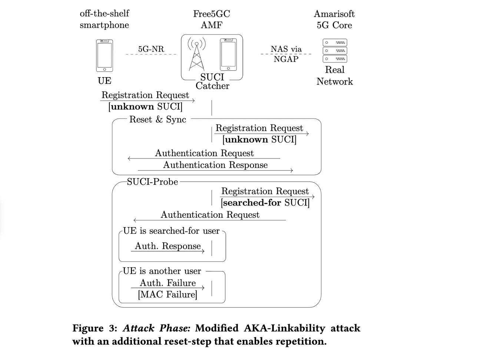

## 5G SUCI-Catchers: Still catching them all?  Wisec’ 21

移动通信网络中的IMSI-Catcher是广为人知的一类攻击，为了缓解用户IMSI被捕获从而泄漏身份相关信息的风险，5G引入了SUPI，即利用加密后的SUSI代替IMSI。本文则展示了一种新的攻击形式，通过捕获用户的SUCI并结合AKA的过程将session与加密后的实体身份信息进行对应，可以判断某个用户是否存在。在5G standalone network中实现了proof-of-concept的攻击。

传统的IMSI-Catcher通过类似伪基站的方式强行吸入终端用户，并获取其身份信息。一般用来做两件事情： 1）获取周围的用户身份信息 2）了解关注的某个特定用户是否存在。本文利用的是AKA过程的一个弱点，即能将用户做mapping关系。主要贡献可概括为：

- 提出了SUCI-Catcher攻击，能在60秒内check 500个关心的用户在不在（实验环境下）
- 在一个standalone的实际环境下对commercial UE完成了测试
- 讨论了如何解决该问题（已通过GSMA CVD流程进行了漏洞披露）

### Background

用户在注册前需要告知核心网其身份信息（4G中的IMSI、5G中的SUCI），不过有一点需要注意，在AKA完成之前，用户与基站之间的所有消息都是未经加密保护的。通常会假设IMSI-Catcher的Attacker拥有作为伪基站与UE完成身份信息交换的步骤（AKA之前）。

攻击可以大致分为两个阶段：1）阶段一，收集SUCI信息；2）判断具体的link session是否属于某个特定的、感兴趣的victim。（IMCI-catcher attack的原理同）。

SUPI加密成SUCI的相关规定可参考3GPP TS 33.501，其对于operator来说是可选项（也就是可以根本不加密直接传输），推荐的有两种算法。

注意：5G对于SUPI保护的关键点在于，不只是加密为SUCI，而且每次SUCI都是重新生成的，与上一次不同，所以攻击者没有办法根据SUCI的值直接做mapping。

本文利用的关键为：UE会对AKA request进行回复，而network的request是带有suci信息的。理论上，当收到是属于自己的SUCI，有可能回链接成功，也可能因为消息过期了（上一次链接使用的SUCI，即攻击场景），会返回错误，错误类型是synch failure；如果不属于自己的消息，会返回mac failure。攻击者就是根据是否成功、如果出错具体是什么错误类型来判断是否猜对了victim。

### SUCI-Catcher Attack

再详细描述一下攻击的两个阶段：

- Phase 1，Discovery

要求：攻击者必须预先获知某个被victim曾经使用过的SUCI，方法大概包括以下两种：

1）直接从5G消息中捕获SUCI，这要求攻击者能够嗅探网络流量以获取SUCI，或者让受害者链接到自己的基站以获取SUCI（需要精准的定位操作）

2）根据4G的IMSI计算得到SUCI（因为operator的公钥是公开的），也就是先在4G条件下利用IMSI-Catcher拿到IMSI，再计算出SUCI

- Phase 2，Attack

攻击流程如上图所示，又可以进一步分为SUCI-Probe和Reset&Sync两个阶段。

1）SUCI-Probe。攻击者将SUCI-searched-for加入 注册请求消息，发送给Network，Network会返回一个只有searched-for-UE才能返回成功或者Synch Failure，如果不是searched-for会返回MAC failure）

2）由于观察到UE在两次connect failure之后就不再发送request了，为了保证攻击能够持续进行，在中间增加了一个reset&sync，即使用ue的unknown SUCI向network发送请求，争取与UE建立一次成功的联机，以避免UE的request直接停掉。

### Attack Evaluation

在实验室的模拟5G环境下进行了proof-of-concept的攻击测试，环境使用包括：

- sysmocom 的 USIM卡
- Amarisoft的gNodeB
- Amarisoft的Core Network
- Free5GC的Core Network

在真实网络（商业网络）环境下其实测试的是4G的一些性能参数，以讨论5G情况下攻击实施的可能性）。

### Discussion & Countermeasures

- Disclosure：得到的回复是觉得这个攻击不如IMSI-Catcher的impact严重，但作者claim说在一定的场景下还是有用的
- Countermeasure：预防伪基站、改进AKA是的无法做link（根据response）、基于网络的防御（比如对使用过的SUCI进行保存核对）、基于UE的防御（比如对大量重复的request试探做检测）

### My Comments

- 本文相当于将SUCI的probe技术和基于AKA的link技术做了个结合来完成SUCI-Catcher，需要对SUCI的probe以及AKA相关的问题有充分的了解
- 虽然感觉找到的漏洞不算特别严重，但本文做得比较完整：有充分的背景+攻击流程介绍、5G下的实验（尽管是实验室环境）、实际环境（4G）下各项攻击需要的参数的测量（以补充理论分析部分）