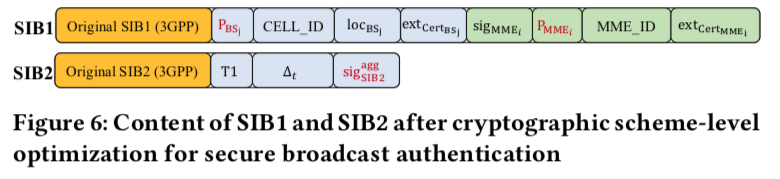
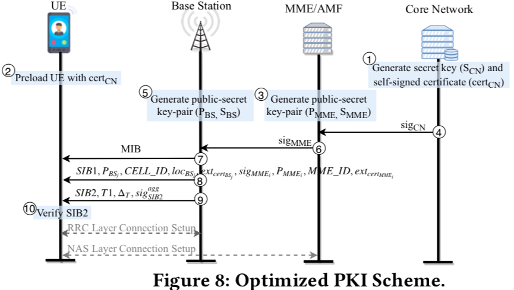

###Insecure Connection Bootstrapping in Cellular Networks: The Root of All Evil - Wisec’19

####**问题描述** 

接入网已有的一个严重问题是，对基站身份的合法性缺少验证机制。这一点甚至在目前的5G协议中也没有修复。 

+ [ ] 5G标准中已经修复的安全问题有哪些？ 

设计该机制的主要挑战有两个： 

1. 需要向前兼容，不改变目前的deployment框架 

2. 除了完成核心需求（对基站验证）之外，还需要考虑实际部署中的一系列限制（QoS，基站和设备的overhead，带宽，MTU等）

3. 1. 证书的传输
   2. Revocation机制的设计 
   3. 如何防止Relay/Replay攻击

威胁模型：攻击者可以窃听以及篡改消息，伪装基站进行攻击。 

目标：从根本原因（MIB/SIB消息没有进行身份验证）上解决这个问题（而不是attack-specific）。即，**为MIB/SIB消息提供认证机制和完整性保护**。 

####**设计思路** 

+ PKI 优化 

+ + 利用eSIM机制更新UE端信任的根证书列表 
  + 轻量级的证书系统（签名的内容简化到最少） 

+ Protocol 优化 

+ + 选择最关键的SIB包进行保护（分析得到的结论是，SIB1、SIB2是最关键的两种信息）（主要关心其是否影响基站连接过程） 
  + SIB1和SIB2因为是一起传输的，所以签名也一起传、一起验证

+ Cryptographic scheme 优化 

+ + 尝试不同的签名算法 

预期效果： 

1. 由于对SIB1和SIB2进行了验证，可以防止伪基站修改SIB信息。  
2. 由于加入了过期时间间隔这一参数，可以防止伪基站重放SIB信息。 
    

####**如何防御Relay Attack** 

1. 加入了基站经纬度的信息loc bs 
2. 为消息的验证加入了过期时间，该过期时间的low bound，就是理论上从基站传输到UE完成验证的最短用时，up bound就是理论上的最长用时（主要是和基站的距离拉长）。但计算的过程略为复杂。 
    

####**Evaluation** 

利用USRP B210和srsLTE完成了本次实验。对不同签名方式的性能进行了评估。 

但对实际环境中伪基站攻击是否的确无法完成没有进行实际评估。（只是理论上讨论了该方案对攻击防御的效果） 

####**Limitation** 

1. 需要UE和基站完成时间同步（作者说可以通过GPS来完成） 
2. 由于有一个up bound的限制，攻击者仍然有可能在有效时间内完成重放攻击（但是攻击的门槛提高了很多） 
3. Emergency Call根据3GPP的设置，是不需要进行authentication的，所以本文的防御对该场景无效。 
    

####**文章优点** 

1. 针对伪基站攻击的root cause提出了解决方案，并实际进行了部署测试  

####**文章不足** 

1. 该方案的思路其实并不难想到（对消息做签名保护） 

2. 方案实施的限制还是比较多： 

3. 1. UE要和BS做到精准的时间同步（否则容易DOS），而且作者也没有讨论如果时间同步出现问题应该怎么办（可用性待评估） 
   2. 对于攻击的防御也只是停留在理论讨论的阶段（包括作者选定的dieta T是否合理，能否在真实环境中实际抵御伪基站的接入（比如可以自己搭建伪基站攻击场景，在没有sib保护时成功连入，但是加了保护之后无法连入）。 

####**If I was the author** 

1. 对方案的可行性可以增加更多讨论和实验。 

2. 1. How to apply this mechanism to 5G 
   2. How to deal with potential errors in the whole validation procedure, e.g., failed time synchronization, non-valided BS found 
   3. Discuss would this mechanism itself brings new attacks to UE (e.g., new Dos attack) 
       